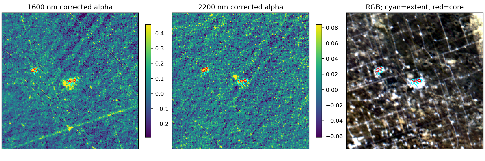
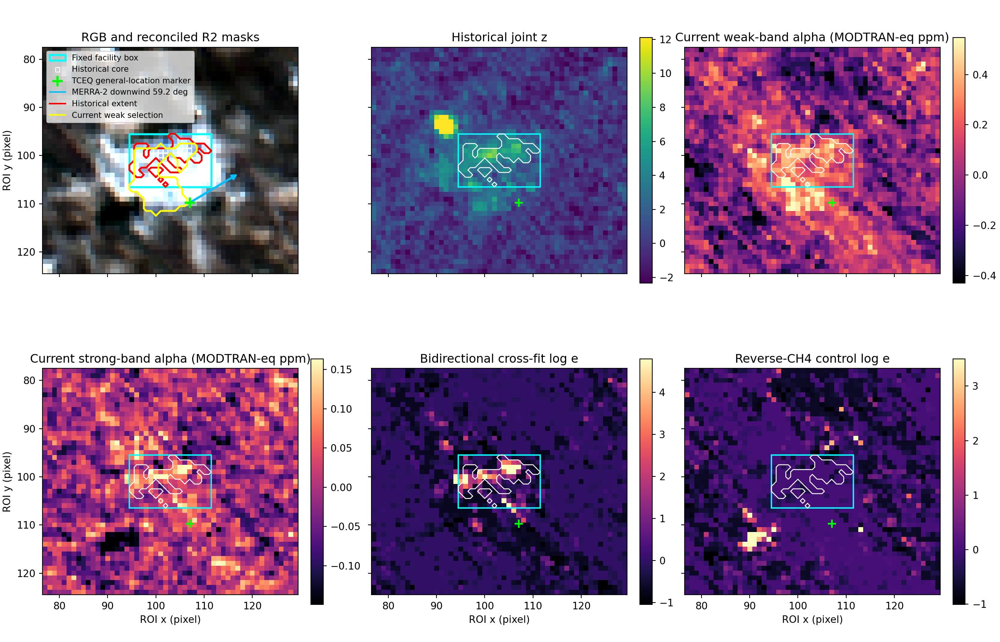

# HISUI methane Iterative MF (1600 + 2200 nm)

HISUIハイパースペクトルデータを対象に、1600 nm帯のIterative Matched Filter、QAに基づく方向性ストライプ除去、2200 nm帯との融合判定を行う研究用コードです。

1600 nmと2200 nmではMFの感度とノイズ分散が異なるため、αを直接加算しません。各帯域をmedian/MADでrobust z-score化し、両帯域の正の応答と空間連結性が一致する領域をメタン候補として抽出します。



## 主な処理

1. 1580–1700 nmからCH₄ unit absorption spectrumを作成
2. Iterative MFによる1600 nm αマップの推定
3. QA_DMによる有効画素管理と、各L1G製品から独立推定した広縞方向のストライプ除去
   （PDF-DWTの広縞角はCT方向ではなく、1600/2200 nmで共有する符号付きscene角）
4. 細縞には固定傾き0.9773461のline-median補正
5. 1600/2200 nmのrobust z-score融合
6. 負側tail、空間シフト、既知地表線による偽陽性検査

## フォルダ構成

```text
.
├─ scripts/        解析スクリプト
├─ tests/          合成データを用いた単体テスト
├─ data/           ローカル入力データ（Git管理対象外）
├─ outputs/        実行結果（Git管理対象外）
└─ docs/figures/   公開用の代表結果図
```

## セットアップ

Python 3.10以降を想定しています。

```powershell
python -m venv .venv
.\.venv\Scripts\Activate.ps1
python -m pip install --upgrade pip
python -m pip install -r requirements.txt
```

## 入力データ

元データは容量と配布条件のため、このリポジトリには含まれていません。配置方法と必要なファイル名は [data/README.md](data/README.md) を参照してください。

ROI CSVは次の列を持つ形式です。

```text
y,x,wave_485.00nm,...,wave_1687.89nm,...
```

CH₄ LUT CSVは、波長列と複数の ppm 列（例: `0,0.1,...,5`）を持つ形式です。
波長はµmまたはnmを自動判別します。出力される α は LUT の0 ppm列に対する
MODTRAN-equivalent ppm enhancement で、絶対大気濃度ではありません。

## 実行例

### 1600 nm Iterative MF

```powershell
python scripts/iterative_mf_1600nm.py `
  --roi-csv data/all_roi_spectra200x200.csv `
  --modtran-csv data/ch4_lut.csv `
  --output-dir outputs/iterative_mf_1600nm
```

### QA傾き解析とストライプ除去

```powershell
python scripts/analyze_qa_slope_1600nm.py --qa-dir data/qa

python scripts/refine_2200nm_residual_line.py `
  --qa-output-dir data/2200nm/qa_guided_outputs `
  --mf-output-dir data/2200nm/mf_outputs

python scripts/iterative_mf_1600nm_destriped.py `
  --roi-csv data/all_roi_spectra200x200.csv `
  --modtran-csv data/ch4_lut.csv `
  --reference-2200-mask data/2200nm/reference_plume_mask.npy
```

### 1600/2200 nm融合判定

```powershell
python scripts/fuse_1600_2200_methane_detection.py
```

### 物理UAS＋波長cross-fitted e-value（研究パイロット）

MODTRAN濃度系列をHISUIのSRFに畳み込み、通常MFと、片方の吸収帯で
強度を選んでもう片方の未使用吸収帯で検証するe-valueを同時に計算します。
大きな全体シーンCSVもチャンク処理されます。

```powershell
python scripts/physics_aware_crossfit_mf.py `
  --scene-csv "D:\research\code\all_roi_spectra200x200.csv" `
  --modtran-csv "E:\refit\CH4a.csv" `
  --output-dir outputs/crossfit_final_roi200

python scripts/physics_aware_crossfit_mf.py `
  --scene-csv "E:\refit\all_map_spectra.csv" `
  --modtran-csv "E:\refit\CH4a.csv" `
  --output-dir outputs/crossfit_final_full_scene `
  --spatial-block-size 20 `
  --local-tile-size 250 `
  --local-tile-halo 1
```

主な出力は `analysis_summary.json`、半人工注入の
`injection_benchmark.csv`、`candidate_pixels.csv`、`overview.png` です。
MODTRAN放射輝度を一律100倍しても、log-radiance勾配として求めるUASには
数学的に影響しません。100倍係数は絶対放射輝度の診断にだけ使います。
各吸収帯では既定でlog-radianceの定数項と一次傾きを除き、地表アルベドや
広帯域の明るさ差ではなくCH₄吸収形状を照合します（`--continuum-degree 1`）。
2.40 µm端の1バンドは全体シーンで走査方向アーティファクトを強く拾ったため、
強吸収帯の既定上限は2.390 µmです。逆符号CH₄対照と、正逆を対にした裾診断も
同時に保存します。候補成分のRGB・局所スペクトル図は次のコマンドで作れます。

```powershell
python scripts/inspect_crossfit_candidates.py `
  --scene-csv "E:\refit\all_map_spectra.csv" `
  --analysis-dir outputs/crossfit_final_full_scene
```

注意: 現在のe-valueはGaussian背景のplug-inパイロットです。平均・共分散を
外部背景データで固定した場合に理論上の条件付き妥当性が得られます。この
スクリプトは空間block cross-fittingで同一画素の再利用を避けますが、空間依存を
完全には除去しないため、出力をそのまま厳密なFDR保証とは解釈しません。
今回のデータで得た数値、負の結果、次の実験は
[研究パイロット報告](docs/physics_aware_crossfit_pilot_2026-07-24.md)にまとめています。

### 空間プルーム画像と二吸収帯の領域検証

一方の吸収帯だけで空間候補を作り、もう一方の帯で局所シフト検定する観測画像と、
実 HISUI 背景へ既知 ppm の MODTRAN プルームを注入して回収する画像ベンチマークを
追加しました。


```powershell
python scripts/spatial_region_crossvalidation.py `
  --scene-csv "D:\research\code\all_roi_spectra200x200.csv" `
  --analysis-dir outputs/crossfit_final_roi200 `
  --shift-count 4999

python scripts/spatial_plume_injection_benchmark.py `
  --scene-csv "D:\research\code\all_roi_spectra200x200.csv" `
  --modtran-csv "E:\refit\CH4a.csv" `
  --output-dir outputs/spatial_plume_injection_final `
  --peaks-ppm 0.1,0.2,0.5,1 `
  --trials-per-peak 20
```

方法の数式、観測 ROI・全景の候補画像、濃度別検出確率、ppm 回収精度、解釈上の
注意は [空間プルーム画像研究報告](docs/spatial_plume_imaging_2026-07-24.md) にあります。

### 既知ガスプラント R2 の追試

R2 を Keystone Gas Plant の既知施設候補として固定し、旧 R2 core と現行の
弱帯選択領域を区別した再集計、同サイズ移動矩形との比較、TCEQ 一般位置、観測時刻の
MERRA-2 風向をまとめました。



```powershell
python scripts/known_site_r2_validation.py `
  --scene-csv "D:\research\code\all_roi_spectra200x200.csv" `
  --analysis-dir outputs/crossfit_final_roi200 `
  --historical-dir "C:\path\to\iterative_mf_1600nm_destriped" `
  --output-dir outputs/known_site_r2_validation
```

結果と解釈は
[既知ガスプラント R2 の追試報告](docs/known_site_r2_followup_2026-07-28.md) にあります。

既定条件では、両帯域3 robust σ以上かつ相関補正joint zが4以上をcoreとし、両帯域2σ以上までextentを領域成長します。入力・出力パスや閾値は各スクリプトの `--help` で変更できます。

### L1G からの省メモリ抽出と複数シーン品質管理

185バンドのL1G GeoTIFFを全展開せず、必要なタイルだけを読み出して従来形式の
`y,x,wave_*` CSVへ変換できます。同時に、入力製品、元画像内のROI境界、波長、
放射輝度換算、座標系をJSON sidecarへ保存します。

```powershell
python scripts/export_hisui_region_spectra.py `
  --input "E:\path\to\HSHL1G_product" `
  --output-csv outputs/roi_spectra.csv `
  --center-y 1000 --center-x 1000 --height 200 --width 200 `
  --overwrite
```

Permian Basinの複数L1G製品には、雲プロキシ、飽和画素、`QA_DM`（dead-pixel
correction適用）および`QA_IM`（bad-pixel interpolation適用）の厳格マスクを先に
適用し、雲が多いシーンを候補順位から除外します。方向性ストライプ補正はPermian
で以前推定した方向を使うため、一般の地域には既定適用せず明示的に有効化します。

```powershell
python scripts/screen_hisui_l1g_scenes.py `
  --product-root "E:\path\to\Permian_products" `
  --modtran-csv "E:\refit\CH4a.csv" `
  --known-site-csv docs/known_sites_hisui.csv `
  --cloud-profile cirrus_sensitive `
  --enable-directional-destriping `
  --save-score-maps `
  --output-dir outputs/multiscene_l1g_permian
```

地獄の門の同一観測・新旧L1G処理版は、裸の画素番号ではなく投影座標で位置合わせし、
同じ背景モデルで比較します。明るい砂漠では雲判定を3段階で感度解析してください。

```powershell
python scripts/compare_hisui_reprocessing_pair.py `
  --old-product "E:\path\to\old_product" `
  --new-product "E:\path\to\new_product" `
  --modtran-csv "E:\refit\CH4a.csv" `
  --site-easting 622433.7895 --site-northing 4456781.2984 `
  --cloud-profile desert_balanced `
  --output-dir outputs/darvaza_reprocessing
```

旧R2を後から動かさず、200×200 ROIモデルと全景モデルの同じ固定領域を比較する
感度監査も追加しました。

```powershell
python scripts/compare_r2_analysis_contexts.py `
  --roi-analysis-dir outputs/crossfit_final_roi200 `
  --full-analysis-dir outputs/crossfit_final_full_scene `
  --strict-scene-output outputs/multiscene_l1g_permian/HSHL1G_N320W1032_20221030160051_20231127193053 `
  --output-dir outputs/r2_analysis_context_sensitivity
```

別日時の同一nominal tileでscore mapを比較する場合は、両方を `--save-score-maps` 付きで
screenした後、投影グリッドの共通領域だけを使います。同位置の高値反復は地表・位置ずれ・
装置artifactの診断であり、plume確認ではありません。

```powershell
python scripts/compare_hisui_repeat_acquisitions.py `
  --first-product "E:\path\to\first_product" `
  --second-product "E:\path\to\second_product" `
  --first-scene-output outputs/multiscene_l1g_permian/first_product_id `
  --second-scene-output outputs/multiscene_l1g_permian/second_product_id `
  --output-dir outputs/repeat_acquisition
```

バッチ完了後、正側／逆符号側の全3σ画素と3画素以上の連結成分を、有効100万画素当たりで
集計できます。`--spatial-union` は取得UTC分ごとに投影画素をunionし、隣接タイルの同一地上
画素を1回だけ数える感度解析も保存します（UTC分は公式orbit/strip IDではない再現用heuristicです）。

```powershell
python scripts/summarize_multiscene_tail_balance.py `
  --batch-dir outputs/multiscene_l1g_permian `
  --spatial-union
```

雲量とQAの基準を通った `quality_class=usable` 製品だけを対象に、1600 nm側または
2200–2390 nm側の片方だけでも局所zが3以上となる領域を列挙できます。同一UTC分の
隣接タイルは投影グリッド上でunionし、正側と全く同じ条件の逆符号対照も出力します。

```powershell
python scripts/summarize_single_band_candidates.py `
  --batch-dir outputs/multiscene_l1g_permian `
  --output-dir outputs/single_band_usable_review `
  --known-site-csv docs/known_sites_hisui.csv `
  --known-site-id keystone_general `
  --site-radius-pixels 10
```

提供PDFに記録された画像方向探索を基に、二帯域の相対RStd減少を平均する監査可能な方法へ
形式化した。広縞の符号付き傾きを各シーンの未補正MF scoreから独立に探索して
Haar DWT（level 3–5）を行い、その後に細縞傾き0.9773461で
line-median補正します。広縞角はシーン内で1600/2200 nmと正負対照に共通です。
参照シーンの傾き1.2571723（+51.5°）を全シーンへ固定適用しません。
prominence robust zが5未満、両帯域gainが正でない、または探索端の角度しか得られない
シーンでは広縞DWTをskipし、低信頼角を候補形状の除外にも使いません。このgateは
探索的な安全策であり、統計的有意性を与えるものではありません。

```powershell
python scripts/postprocess_score_maps_pdf_dwt.py `
  --source-batch outputs/multiscene_l1g_permian_final_v4 `
  --output-batch outputs/multiscene_l1g_permian_pdf_dwt_scene_slopes_v5 `
  --minimum-threshold-coefficients 300

python scripts/summarize_single_band_candidates.py `
  --batch-dir outputs/multiscene_l1g_permian_pdf_dwt_scene_slopes_v5 `
  --output-dir outputs/single_band_usable_review_pdf_dwt_scene_slopes_v5_final_2026-08-03 `
  --threshold 3 --minimum-pixels 3 `
  --known-site-csv docs/known_sites_hisui.csv `
  --known-site-id keystone_general --site-radius-pixels 10
```

選択角はbatch直下の `posthoc_pdf_dwt_scene_slopes.csv`、全角度のscore曲線は
`posthoc_pdf_dwt_slope_search.csv` で監査できます。完全supportのlevel 5は推定係数が
少ないため、`500`へ変更してlevel 5を停止した感度解析も必要です。シーン別角にすると、
選択に使った画像・方向上の記述的な広縞profileは14 scene×band中11で低下しましたが、
正側 / 逆符号候補比はprofile主解析より改善せず、MODTRAN注入回収も未検証です。このため、
現時点ではPDF-DWTをprimary補正に採用していません。

出力される全候補、画像確認用shortlist、保守的single-window判定はいずれも探索用です。
今回の数値、候補ギャラリー、数式、R2への影響は
[usableシーン単帯域候補報告](docs/single_band_usable_candidates_2026-08-02.md)にまとめています。

上位候補は全景の最大値だけで判断せず、browse、cloud/valid、弱帯、強帯、dual、逆符号を
同じcropで確認します。

```powershell
python scripts/plot_hisui_candidate_crop.py `
  --product-dir "E:\path\to\HSHL1G_product" `
  --scene-output outputs/multiscene_l1g_permian/HSHL1G_product_id `
  --candidate-rank 1 --tail positive_ch4 --half-size 40 `
  --output-dir outputs/candidate_crop
```

New Mexicoの候補は、OCD公式ArcGIS RESTのOil Wells / Gas Wellsを同じ投影座標で照会し、
現在の台帳点までの距離を図にできます。EPSG:32613と台帳native EPSG:26913のdatum変換を
ArcGISへ明示し、生レスポンスとprovenance JSONも保存します。設備近接は撮像時の排出証拠では
ありません。NASA POWERの緯度経度・UTC日時を指定すると、10 m風をAPIから取得し、request
URL・query・生JSON・SHA-256を保存したうえで風下方向だけを模式表示します。

```powershell
python scripts/plot_candidate_well_context.py `
  --candidate-easting 653840 --candidate-northing 3566440 `
  --epsg 32613 --radius-m 750 --label-count 5 `
  --power-latitude 32.2241 --power-longitude -103.3674 `
  --power-date-utc 2022-10-30 --power-hour-utc 16 `
  --output-dir outputs/candidate_well_context
```

方法、数式、雲除外を含む全結果と次の研究方針は
[複数地域L1Gメタン画像研究報告](docs/multiregion_l1g_methane_2026-07-28.md) にまとめています。

## テスト

```powershell
python -m unittest discover -s tests -v
```

## 旧200×200 ROI pipelineでの履歴的結果

以下は固定R2を含む旧ROI pipelineの結果であり、最終的なQA-strict全景screenの判定では
ありません。旧設定での感度を記録するため残しています。現在の結論と全地域比較は
[multiregion L1G methane report](docs/multiregion_l1g_methane_2026-07-28.md)を参照してください。
同報告の最終screenではR2のdual local z最大は1.659、$z\ge3$ は0画素で、候補閾値を
通過していません。

|候補|core / extent|ROI座標 (y, x)|joint z 最大|
|---|---:|---|---:|
|R1|26 / 53画素|y=79–90, x=42–53|8.729|
|R2|22 / 70画素|y=96–106, x=95–111|9.653|

空間シフト1000回の帰無試験で、実測の連結core 48画素以上になった例は0回でした。負側3σでは連結成分0、既知の右下地表線も最終core・extentとも0画素でした。詳しい診断図は [dual_band_detection_diagnostics.png](docs/figures/dual_band_detection_diagnostics.png) にあります。

## 注意

この判定は「両吸収帯で正のMF応答が空間的に一致するメタン適合領域」を示します。メタン排出の確定には、風向・風速、設備位置、別時刻または別センサとの照合が必要です。RGB上の明るい地表構造に重なる候補は、surface spectral artifactの可能性も残ります。

## 謝辞

基本的なIterative MFの構成は [dora-743/MF](https://github.com/dora-743/MF/tree/main/IterativeMF) を参照しています。

## License

ライセンスはまだ指定していません。再利用・再配布についてはリポジトリ所有者へ確認してください。
