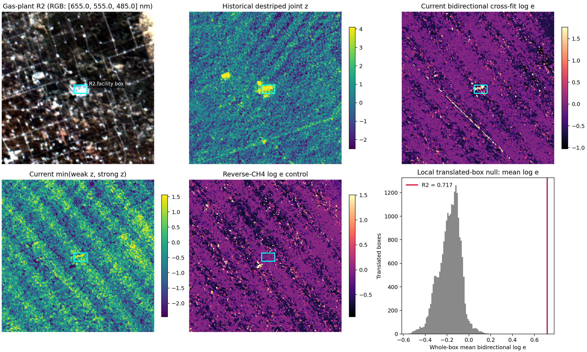

# 既知ガスプラント R2 の追試と研究方針

実施日: 2026-07-28

## 結論

R2 は単なる任意の高スコア領域ではなく、外部資料で確認できる **Keystone Gas
Plant** と位置が整合する。旧二帯域 MF と現行の MODTRAN・波長 cross-fit 解析を
同じ旧 R2 core で集計し直すと、旧法では両帯の高応答、現行法では一部画素の両帯支持と
同一画素の局所共通ピークが確認できた。したがって、以前の「R2 は強帯で弱いので地表
偽陽性寄り」という解釈は修正する必要がある。

一方、現時点の最も妥当な判定は **既知排出源の一般位置近傍にある優先検証候補** であり、
「2022-10-30 の HISUI 画像でメタンプルームを確定検出した」ではない。理由は、
信号が明るい施設表面と重なること、同一観測を繰り返し解析していること、粗い風況
データに対して一貫した風下形状を示さないこと、列別波長校正を利用できていないこと、
および独立観測で未検証なことである。


図の水色矩形は旧 R2 extent の外接矩形、白い四角は旧 core、赤線は旧 extent、黄線は
現行弱帯選択領域である。緑の `+` は TCEQ が示す施設の一般位置、青矢印は観測時刻の
MERRA-2 10 m 風から求めた輸送方向である。施設位置は設備単位の漏洩点ではなく、
HISUI の絶対位置にも誤差があるため、緑点との画素単位の一致は要求しない。

## 1. 外部情報による R2 の同定

HISUI 製品の GeoTIFF は WGS84 / UTM zone 13N、20 m pixel である。200 × 200 ROI の
全景オフセットは row 966、column 1363 であり、製品の tie point を使うと

$$
X=655620+20x_{full},
\qquad
Y=3557620-20y_{full}
$$

となる。TCEQ の許可資料が示す Keystone Gas Plant の一般位置
$(31.945833^\circ\mathrm{N},\ 103.0425^\circ\mathrm{W})$ を同じ座標系へ変換すると、
ROI 座標はおよそ $(y,x)=(109.78,107.05)$ である。旧 R2 矩形中心
$(101,103)$ との差は 9.67 pixel、約 193 m だった。

この差は、TCEQ の点が「一般位置」であることと、HISUI 公式情報の nominal case
における絶対位置誤差 200 m 未満という範囲を考えると整合的である
([HISUI calibration / validation](https://www.hisui.go.jp/en/product/validation.html))。
TCEQ は同施設を
Natural Gas Liquid Extraction facility と明記している
([TCEQ permit O2940](https://records.tceq.texas.gov/cs/idcplg?IdcService=TCEQ_EXTERNAL_SEARCH_GET_FILE&Rendition=Web&dID=7520096))。

さらに Texas の 2022 年温室効果ガス台帳は Keystone Gas Plant、Facility ID
1005181 の年間 CH4 排出を **1,265.78 metric tonnes** と掲載している
([TCEQ 2022 Texas Greenhouse Gas Inventory, Table A2-14](https://www.tceq.texas.gov/downloads/agency/climate-pollution-reduction-grants/2022-texas-greenhouse-gas-inventory.pdf))。
これは当該時刻の濃度上昇を意味しないが、「メタン排出があり得る施設」という事前情報
を定量的に裏付ける。

## 2. なぜ以前の解釈を修正するのか

以前の解析では、同じ R2 という名前に異なるマスクが使われていた。

| 定義 | ROI 範囲 | 画素数 |
|---|---:|---:|
| 旧 dual-band R2 core | $y=97$–$101$, $x=96$–$108$ | 22 |
| 旧 dual-band R2 extent | $y=96$–$106$, $x=95$–$111$ | 70 |
| 旧 cross-band consensus R2 | $y=97$–$101$, $x=96$–$108$ | 23 |
| 現行の弱帯選択 R2 | $y=98$–$112$, $x=95$–$108$ | 120 |

現行 120 画素は旧 core の 19/22 画素を含む一方、南側の「弱帯だけが高い」画素まで
広がる。Jaccard 係数は旧 core に対して 0.154、旧 extent に対して 0.301 にすぎない。
したがって、現行 120 画素で算出した強帯平均を旧 core の検証結果として扱うことは
できない。

旧 MF の各帯を robust 標準化した量は

$$
z_b(p)=
\frac{\alpha_b(p)-\operatorname{median}_{q\in\mathcal B}\alpha_b(q)}
{1.4826\operatorname{MAD}_{q\in\mathcal B}\alpha_b(q)}
$$

である。背景で求めた帯域間相関を $\rho$ とすると、旧 joint score は

$$
J(p)=\frac{z_{1600}(p)+z_{2200}(p)}{\sqrt{2+2\rho}},
\qquad
A(p)=\min\{z_{1600}(p),z_{2200}(p)\}
$$

である。旧 core を固定して再集計した結果は次の通りだった。

| 指標 | 旧 1600 nm | 旧 2200 nm | 旧 joint |
|---|---:|---:|---:|
| $\alpha$ 平均 | 0.6267 | 0.1169 | — |
| robust $z$ 平均 | 5.430 | 4.830 | 7.022 |
| 最大 | 0.8144 | 0.1702 | 9.653 |

旧二帯の最大は同じ ROI 画素 $(100,101)$ だった。ストライプ補正前後を比較すると
core 平均は 1600 nm で 5.79%、2200 nm で 14.53%低下した。補正が R2 の絶対応答を
人工的に増幅した形ではない。ただし、高応答画素を補正時に保護したことと、同じ観測で
補正法を比較したことによる選択バイアスは残る。

## 3. 現行 MODTRAN・cross-fit 解析での再現

現行解析では 1.58–1.75 µm を weak band、2.20–2.39 µm を strong band とし、
MODTRAN 濃度 sweep から作った unit absorption spectrum を用いた。matched filter は

$$
\widehat\alpha=
\frac{t^\mathsf{T}\widehat\Sigma^{-1}(y-\mu)}
{t^\mathsf{T}\widehat\Sigma^{-1}t},
\qquad
z=\frac{t^\mathsf{T}\widehat\Sigma^{-1}(y-\mu)}
{\sqrt{t^\mathsf{T}\widehat\Sigma^{-1}t}}
$$

である。ここで $y$、$\mu$、$t$、$\widehat\Sigma$ は各波長窓で continuum を除いた
log-radiance 特徴量、その背景平均、同じ射影を施した CH4 target、shrinkage 背景共分散
である。$\widehat\alpha$ は **MODTRAN-equivalent ppm enhancement** であり、HISUI
画素の絶対 CH4 濃度ではない。二方向の波長 cross-fit は、一方の帯域で選んだ振幅を
もう一方の未使用帯域で評価した likelihood ratio の平均であり、実装の集約量は

$$
\log e_{bi}=
\log\!\left(\frac{e_{strong\to weak}+e_{weak\to strong}}{2}\right)
$$

である。

旧 R2 core 22 画素に現行 map を固定すると次の結果になった。

| 現行指標 | 平均 | 最大 |
|---|---:|---:|
| weak-band $\widehat\alpha$ | 0.3669 ppm-eq | 0.5513 ppm-eq |
| strong-band $\widehat\alpha$ | 0.1112 ppm-eq | 0.2625 ppm-eq |
| combined $\widehat\alpha$ | 0.2007 ppm-eq | 0.3697 ppm-eq |
| bidirectional $\log e$ | 3.320 | 11.520 |

weak、strong、combined、$\log e$ の core 内最大はすべて $(98,107)$ で一致した。
weak と strong の最大値は全 40,000 画素のそれぞれ 99.8525、99.8700 percentile、
combined は 99.9975 percentile だった。したがって「旧プラント core では二帯が
同じ場所で高い」という観察は、異なる前処理と target を使う現行法でも**局所ピーク
について**再現した。ただし現行 strong-band $z$ の core 平均は 1.778 であり、施設
矩形内で weak/strong とも $z\ge2$ なのは 7 画素、最大連結成分は 4 画素に限られる。

旧 R1 と比較すると、現行 bidirectional $\log e$ の core 平均は R1 が 0.312、
R2 が 3.320 だった。weak-band $\alpha$ は R1 も高いが、strong-band と cross-fit の
支持は R2 の方が明瞭である。この差は二帯照合を続ける価値を示す。

## 4. 固定施設矩形と局所対照

高い画素だけを再利用しない診断として、旧 R2 extent の外接矩形 11 × 17 pixel
全体を集計し、同じ大きさの矩形を中心距離 25–90 pixel の範囲へ平行移動した
22,204 位置と比較した。位置 $k$ の矩形を $B_k$、評価 map を $S$ とすると

$$
T_k=\frac{1}{|B_k|}\sum_{p\in B_k}S(p)
$$

とし、位置的な上側 tail fraction を

$$
p_{pos}=\frac{1+\sum_{k=1}^{K}\mathbf{1}(T_k\ge T_{R2})}{K+1}
$$

で求めた。

| 指標 | R2 矩形 | R2 以上の移動矩形 | $p_{pos}$ |
|---|---:|---:|---:|
| 旧 joint $z$ 平均 | 3.688 | 0 / 22,204 | $4.50\times10^{-5}$ |
| 現行 dual-min $z$ 平均 | 0.269 | 393 / 22,204 | 0.0177 |
| 現行 bidirectional $\log e$ 平均 | 0.717 | 0 / 22,204 | $4.50\times10^{-5}$ |
| 逆 CH4 $\log e$ 平均 | −0.100 | 2,687 / 22,204 | 0.121 |

二帯とも $z\ge2$ の空間連結性についても、R2 矩形は旧法で 75 画素・最大成分
70 画素、現行法で 7 画素・最大成分 4 画素となり、いずれも移動矩形の最大値を
上回った。

ただし、これは厳密な独立標本の $p$ 値ではない。移動矩形は互いに大きく重なり、
地表は空間的に交換可能とは限らない。また RGB 平均・分散で最も近い対照矩形でも
robust distance 5.16 と遠く、明るい施設表面と同等の対照をこの ROI 内で確保できなかった。
したがって、この結果は「R2 が局所画像内で非常に特異」という順位診断であり、
メタンである確率ではない。



## 5. 風向との整合性

観測中心時刻は 2022-10-30 16:00:51 UTC である。施設位置に対する NASA POWER
MERRA-2 の 16 UTC 10 m 風は 2.79 m s$^{-1}$、風向 239.2°（西南西から）だった。
従って期待輸送方向は 59.2°、北東向きである。NASA POWER の風向は気象学の規約、
すなわち「風が来る方向」である
([NASA POWER wind methodology](https://power.larc.nasa.gov/docs/methodology/meteorology/wind/),
[Hourly API](https://power.larc.nasa.gov/docs/services/api/temporal/hourly/),
[今回の UTC 時系列応答](https://power.larc.nasa.gov/api/temporal/hourly/point?parameters=WS10M%2CWD10M%2CU10M%2CV10M&community=SB&longitude=-103.0425&latitude=31.945833&start=20221030&end=20221030&format=JSON&time-standard=UTC))。

TCEQ 一般位置を頂点とする半角 60°、半径 2–15 pixel の対称な風下・風上 cone を
比較した。

| 指標 | 風下平均 | 風上平均 | 風下 − 風上 |
|---|---:|---:|---:|
| 旧 joint $z$ | 0.595 | 0.966 | −0.371 |
| 現行 bidirectional $\log e$ | −0.038 | −0.236 | +0.197 |
| 現行 weak-band $\alpha$ | −0.010 | +0.100 | −0.110 |
| 現行 strong-band $\alpha$ | −0.007 | −0.014 | +0.007 |

現行 $\log e$ の最大画素は広い風下 cone に入るが、旧 joint と weak-band の平均・
上位 tail はむしろ風上側が高く、strong-band には差がない。よって **一貫した風下
プルーム形状は確認できない**。MERRA-2 は粗い再解析で、TCEQ 点も実際の排気口では
ないため否定証拠としても限定的だが、現時点で排出プルームを断定できない主な理由に
なる。

## 6. HISUI 製品校正の影響

使用製品は `HSHL1G_N320W1032_20221030160051_20231127193053` で、metadata は
次を示す。

- Product / Processor version: 3.1.0
- Radiometric DB: `HSHRDB_20220625170000_301_001`
- Geometric DB: `HSHGDB_20191205000000_202_003`
- band 115: 1600.4550 nm、FWHM 13.2377 nm
- band 163: 2199.9750 nm、FWHM 13.1878 nm

HISUI 公式の校正表では、この radiometric DB は旧 version 3.01 に属する。該当観測
期間の SWIR smile は 2 nm 未満とされる。公式表が version 3.01 について明記する
crosstrack 輝度偏差は比較的低放射の **VNIR** に関するものであり、本研究の二つの
SWIR CH4 窓に同じ欠陥があることを直接示すものではない。version 4 はこの VNIR 偏差を
改善しており、公開製品は順次置換される
([HISUI calibration / validation](https://www.hisui.go.jp/en/product/validation.html))。

本製品の単一バンド波長表だけでは列別 smile を復元できない。よって次の独立検証では
target 波長を ±2 nm ずらす感度解析を加える。version 4 の同一製品も入手できれば
同じ固定条件で再処理し、校正更新に対する頑健性を確認する。

## 7. 研究上の判定と次の実験

既知施設との一致は attribution の事前情報であり、spectral detection の代わりでは
ない。産業施設の concrete や mineral surface は 2.3 µm 付近でメタンに似た応答を
作るため、multi-window residual と地表スペクトル対照が必要である
([Bärligea et al., 2023](https://doi.org/10.5194/amt-16-4195-2023),
[Roger et al., 2024](https://doi.org/10.5194/amt-17-1333-2024))。また背景の学習時には施設と
予想風下領域を除外する必要がある
([Ayasse et al., 2023](https://doi.org/10.5194/amt-16-6065-2023))。

次の順序で研究を進める。

1. **Keystone Gas Plant の座標を先に固定して別時刻を解析する。** 同一シーンで候補を
   見てから場所を選ぶ循環を止め、少なくとも複数日の repeatability を評価する。
2. **地表偽陽性をモデルに入れる。** concrete、roofing、bare mineral soil の target
   library と CH4 target を同時回帰し、2.3 µm 主帯と 1.6 µm 支持帯の残差を画像化する。
3. **列別波長と校正版への感度を調べる。** CH4 target を ±2 nm ずらし、version 4 の
   同一製品を取得できれば、同じ固定条件で再解析する。
4. **設備位置と高時間分解能風を入れる。** TCEQ の一般点ではなく equipment polygon
   または stack/vent 座標、可能なら HRRR などの局所風を用い、風下 sector を解析前に
   固定する。
5. **プルーム形状が再現してから排出量へ進む。** 風下に連続する column enhancement
   が得られた場合だけ、IME と風速による排出率推定を行う。衛星画像からの点源定量は
   風とプルーム形状を明示的に使う必要がある
   ([Varon et al., 2018](https://doi.org/10.5194/amt-11-5673-2018),
   [Varon et al., 2020](https://doi.org/10.1021/acs.est.0c01213))。

現段階の論文向け表現は、次が妥当である。

> A spatially coherent methane-like enhancement, with localized support from
> both absorption windows, was recovered near the general location of the
> Keystone Gas Plant by two analysis pipelines applied to the same HISUI
> acquisition. The signal is a priority source candidate, but it is not a
> confirmed methane plume because surface confounding, post-hoc scene reuse,
> unavailable column-specific wavelength calibration, and inconsistent wind
> alignment remain unresolved.

## 8. 再現方法

```powershell
python scripts/known_site_r2_validation.py `
  --scene-csv "D:\research\code\all_roi_spectra200x200.csv" `
  --analysis-dir outputs/crossfit_final_roi200 `
  --historical-dir "C:\Users\yudon\OneDrive\ドキュメント\New project\outputs\iterative_mf_1600nm_destriped" `
  --output-dir outputs/known_site_r2_validation
```

主要出力は `site_metric_summary.csv`、`fixed_mask_score_summary.csv`、
`historical_region_comparison.csv`、`wind_sector_screen.csv`、`summary.json`、および二つの
PNG 図である。`outputs/` は Git 対象外なので、公開用図だけを `docs/figures/` に保存する。
