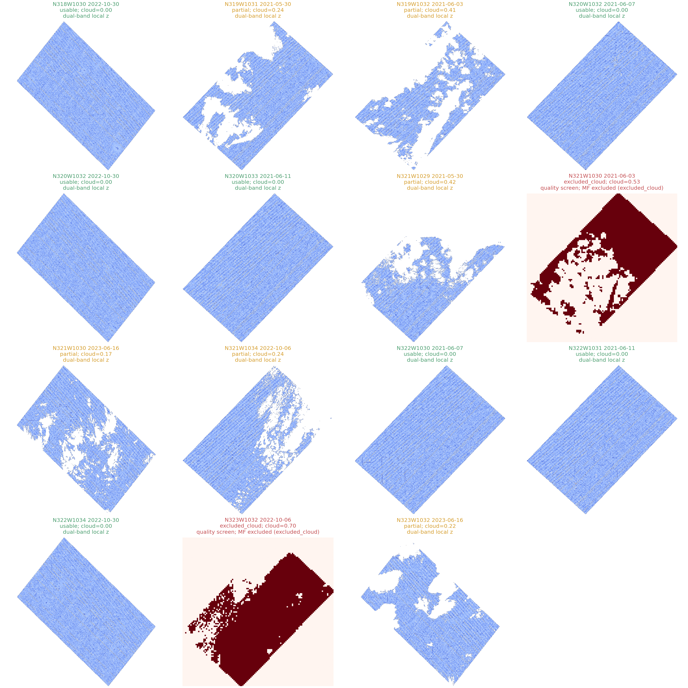
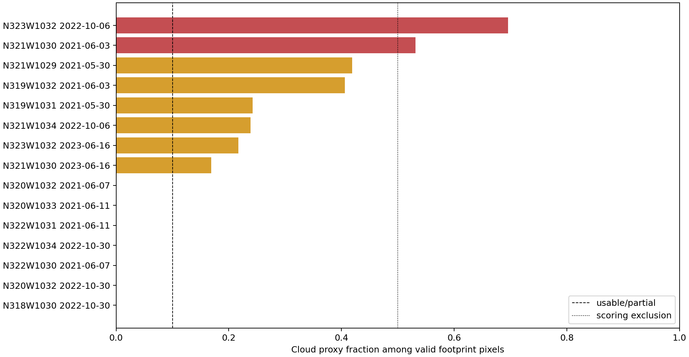
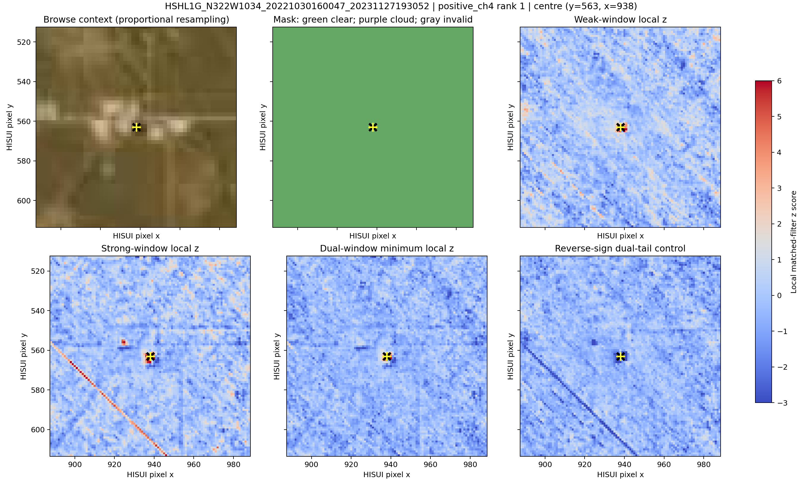
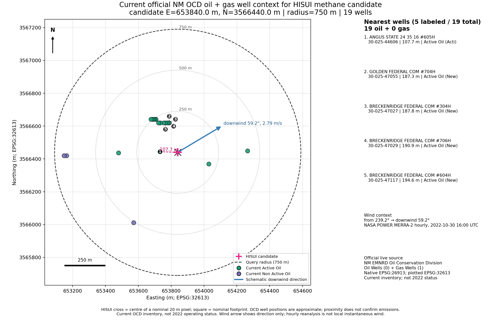
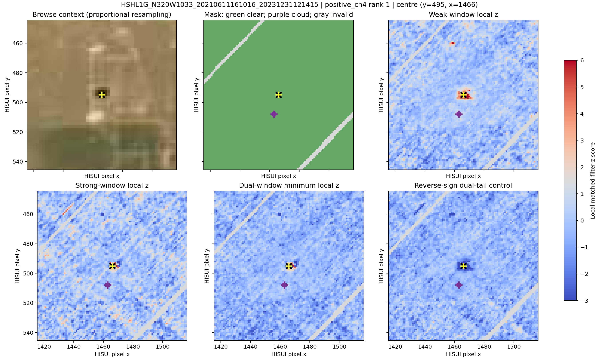
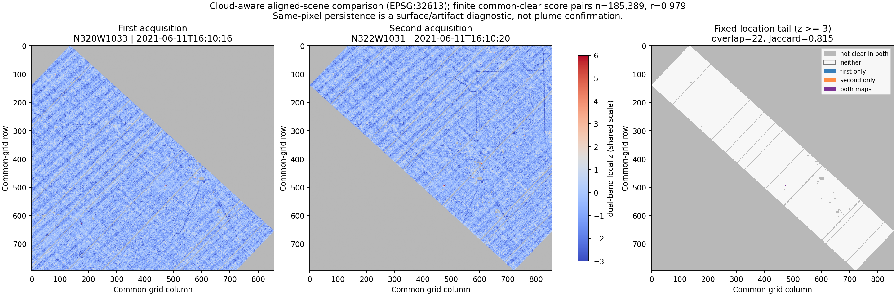
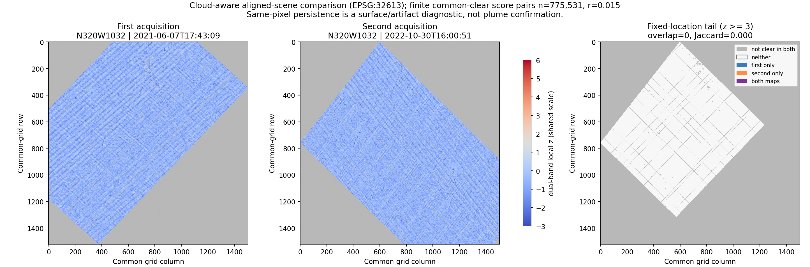
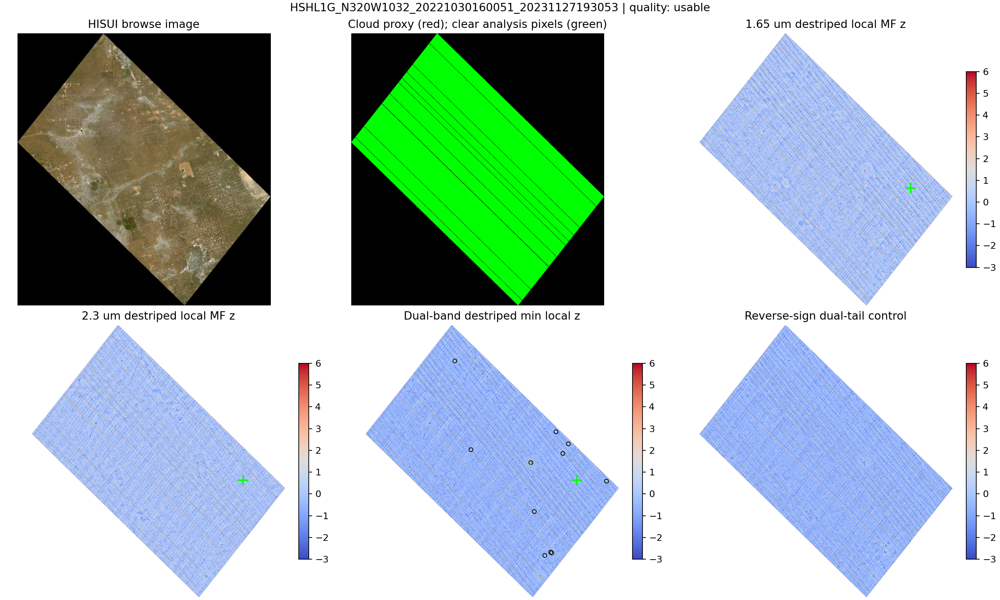
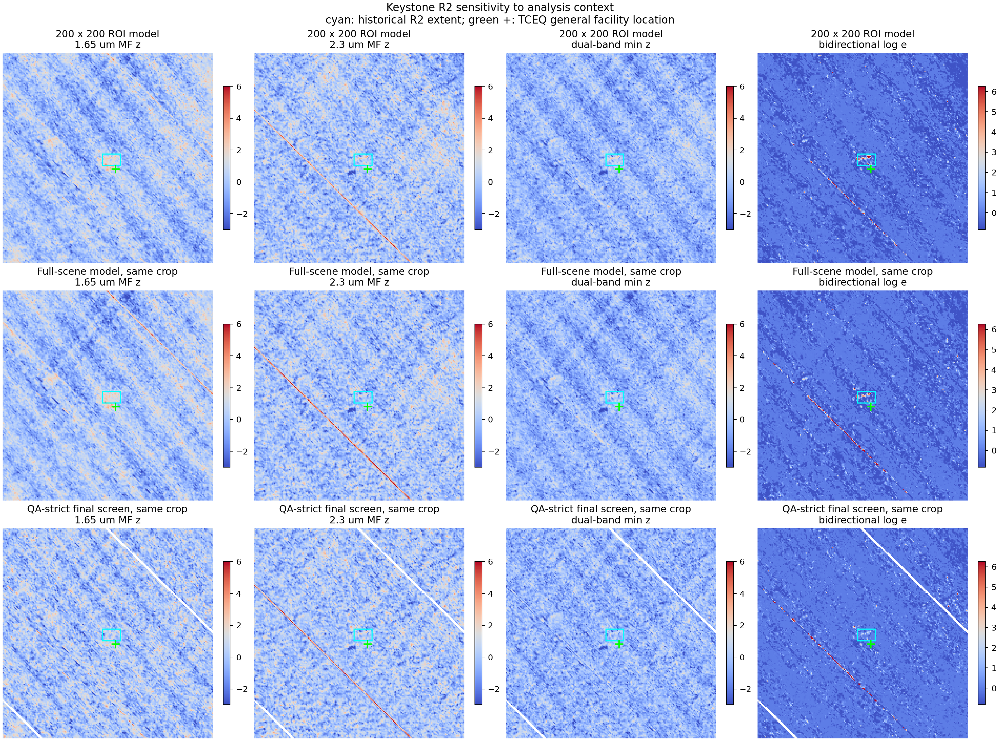
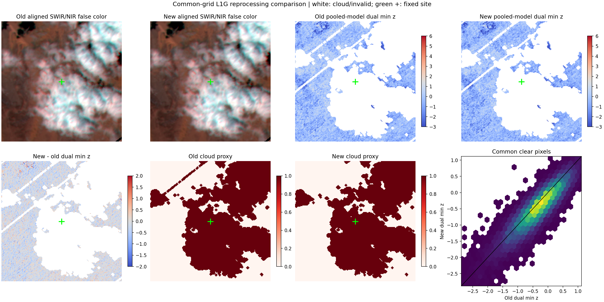

# HISUI L1G 複数地域メタン候補画像：雲品質管理・再処理安定性・R2再現性

作成日: 2026-07-28

## 結論

今回の解析は、候補を増やすことよりも、**雲、検出器補正、ストライプ、解析contextへの
依存性を明示し、固定条件で得た候補を保守的に解釈する**ことを優先した。Permian Basin 15製品の
最終集計は本節末の表に示す。Darvazaの2製品は別時刻ではなく、2021-08-03の同一観測を
version 3.00と3.01で処理した組である。火口周囲は両製品とも雲率100%であり、この観測を
Darvazaのメタン検出には使用できない。一方、周辺晴天域のband別放射輝度相関は0.996前後と
高く、dual-band scoreのbulk相関は約0.90だった。放射輝度は高安定、検出器mapは中～比較的
強い一致と区別する。弱帯と強帯が同時に $z\ge3$ となるdual-min正tailは両版とも0なので、
この共通高tailの再現性は未検証である。

以前のKeystone Gas Plant候補R2は、固定した旧R2領域内のband別局所高値がROIモデルと
全景モデルの両方に残った。しかし、同じpeak座標の再現を意味しない。dual-min z の最大は
2.896から2.561へ、領域平均は
0.269から−0.032へ低下した。さらに今回のQA-strict・方向補正・局所標準化を含む最終全景
screenでは、固定R2 extentのdual local z は平均−0.256、最大1.659で、3以上の画素は0だった。
したがってR2は追跡価値のある既知施設候補ではあるが、今回の画像から「メタンプルームを
確定」とは表現できない。nuisance model、fold/block設定、QA、斜めストライプ処理を含む
pipeline contextへの感度が残り、より厳しいpipelineでは候補閾値を通らないためである。

Permian Basinでは15製品（7観測ストリップ）すべてで必要なQAを読めた。raw cloud proxyにより7製品を
`usable`、6製品を`partial`、2製品を`excluded_cloud`とし、13製品を正式screenへ残した。
除外した2製品のraw cloud率は0.531と0.696である。製品単純和で約1,704万analysis-valid画素の
$D\ge3$ tailは正側1,036画素（60.8/100万画素）、逆符号側584画素（34.3/100万画素）、
3画素以上の成分は110対39だった。正側への偏りは存在するが、多重比較を制御した検出確率では
なく、地表材と残留系統誤差を含む記述統計である。同一撮像の隣接タイル重複を同じ投影画素で
1回にすると15,989,997画素、正／逆tail 957／564、比1.70、成分104／38となる。
採用13製品は7観測ストリップに属するため、13/13は独立反復でなくproduct-level consistencyである。
重複候補を1件に畳んだ後の優先候補は、
雲から343 pixel離れ、二帯で整合し、公式oil wellから約108 mのN322W1034候補である。ただし
点状で地表境界に近く、現段階では未確認候補である。全成分中の最大は隣接2タイルの重複部で
同一座標に再現したが、撮像時刻差は4.16秒なので、独立した時間再現ではなく同一観測内の
処理・タイル整合性である。browse画像では点状の高contrast地物と重なり、風下へ伸びる形では
ないため、現段階ではメタンplumeより地表confuserを優先して疑う。

## 1. 使用データと研究上の役割

| データ | 内容 | この解析での役割 |
|---|---|---|
| Permian Basin | L1G 15製品、7観測ストリップ／日時 | 雲除外後の地域横断候補画像、正負tail対照 |
| Keystone 200×200 ROI | `all_roi_spectra200x200.csv` | 旧R2を固定した解析context感度試験 |
| Keystone全景CSV | `all_map_spectra.csv` | 同じR2を全景側モデルで再評価 |
| Darvaza v3.00 / v3.01 | 同一の2021-08-03観測を2回処理 | L1G再処理安定性と雲による不使用判定 |
| MODTRAN | `CH4a.csv`、1行目がppm | 全地域に共通のCH4 unit absorption spectrum |

Permianの15製品は同じ施設を15回観測した時系列ではなく、7観測ストリップ内の異なるタイルを含む。
製品単純和には同一撮像・同一投影画素の重複が1,053,243画素（6.18%）含まれる。
従って、Keystone R2の時間反復性を15回検証したとは解釈しない。Darvazaの2製品も同一観測の
再処理版なので、排出の時間反復性ではなく処理安定性だけを検証する。

## 2. L1Gの読み出しと放射輝度

HISUI L1Gの185バンドGeoTIFFは約1.2 GBになる。解析コードはROI出力時には必要な16×16
pixelタイルだけを復号し、全景解析時にも必要バンドだけを残す。DNから放射輝度への変換は
metadataの係数を使い、各バンドで

$$
L_{p\lambda}=a_\lambda\,\mathrm{DN}_{p\lambda}+b_\lambda
$$

とした。ここで $p$ は画素、$\lambda$ はHISUIバンドである。ローカル製品ではVNIRに
$a=0.01,b=-10$、SWIRに $a=0.0032,b=-3.2$ が指定されている。出力CSVの単位は
L1G metadataに従う $\mathrm{W\,m^{-2}\,sr^{-1}\,\mu m^{-1}}$ であり、HISUI側を
100倍していない。

GeoTIFFは `RasterPixelIsPoint` であるため、生tie pointは画素中心を表す。実装では最初に
半画素外側へ移したGDAL型のpixel-corner affineへ正規化し、画素中心の順変換と投影座標から
画素への逆変換を同じ規約に揃えた。これにより従来生じていた約半画素の系統ずれを除いた。

## 3. 雲と検出器QAを先に判定する理由

### 3.1 雲プロキシ

各品質管理バンドのTOA反射率を

$$
\rho_{p\lambda}=m_\lambda\,\mathrm{DN}_{p\lambda}+c_\lambda
$$

で求める。Permian用の `cirrus_sensitive` profileでは、1.388 µmの高い応答と、
可視・近赤外で明るく中立な厚い雲を組み合わせた。

$$
C_{\mathrm{cirrus}}
=\mathbf{1}\!\left(\rho_{1388}>0.035,\ \rho_{865}>0.18\right)
$$

$$
N_{665,865}
=\frac{|\rho_{665}-\rho_{865}|}
{\max\{(\rho_{665}+\rho_{865})/2,10^{-6}\}}
$$

$$
C_{\mathrm{bright}}
=\mathbf{1}\!\left(
\rho_{665}>0.28,\ \rho_{865}>0.30,\ \rho_{1650}>0.18,
\ N_{665,865}<0.12
\right)
$$

飽和した品質管理バンドも雲側へ保守的に入れ、最終的に

$$
C=C_{\mathrm{cirrus}}\lor C_{\mathrm{bright}}\lor C_{\mathrm{saturated}}
$$

をraw cloud maskとした。これは公式HISUI cloud productではなく、ブラウズ画像と照合した
固定proxyである。品質分類に使う雲率は、膨張前の

$$
f_{\mathrm{cloud}}=\frac{\sum_p V_pC_p}{\sum_p V_p}
$$

である。ここで $V$ は品質バンドが有効でQA補正flagのない画素である。雲率10%以下を
`usable`、10–50%を `partial`、50%超を
`excluded_cloud` とした。早期検査はnative tileのstride 8から始める。ただし雲率が
50%を超えた場合はstrideを8→4→2→1へ段階的に密化し、**全native tileを確認した後も
50%を超える場合だけ**全景MFを省略する。粗い固定格子だけでは周期的な補正痕とのaliasで
良好シーンを誤除外し得るためである。採用シーンは全画素の $C$ を作る。早期除外シーンも
stride 1で全native tile内の全画素を読んでraw雲率を確定するが、保存する除外図は各tileの
雲率が25%以上かを示す粗いtile-prevalence proxyであり、pixel-level cloud maskではない。
採用シーンのMF clear maskには $C$ を2 pixel膨張した $C^{(2)}$ を使う。SciPy既定の4近傍
構造を2反復するため、これは正方形ではなくtaxicab距離2のdiamondである。表には分類用の
採用sceneではraw雲率と解析用の膨張後雲率を分けて保存した。早期除外sceneはpixelwise膨張
maskを作らないためraw雲率のみである。

明るい砂漠は単純な `rho665 > 0.28` だけで雲と誤認される。そのためDarvazaでは、
1.388 µm閾値と明るさ・中立性を同時に変えた `desert_sensitive`、
`desert_balanced`、`desert_core` の3条件を使用した。どの条件でも火口周囲121画素は
100%雲となった。

### 3.2 `QA_DM` と `QA_IM`

HISUI Product Format Descriptionによると、`QA_DM` はdead-pixel correctionが適用された
band-pixel、`QA_IM` はbad-pixel interpolationが適用されたband-pixelを示す。これらは
単なる `DN=1` とは異なる補正履歴である。本解析のstrict primary mapでは、弱帯または
強帯の選択バンドの一つでも該当する画素を、背景共分散と候補判定の両方から外した。
また、雲判定に用いる5バンドでも同じQA画素を雲率の分子・分母から除外した。QAファイルが
欠ける製品は `qa_incomplete` とし、正式な候補ランキングへ入れない。
PermianのKeystone製品では、両メタン窓のいずれかで `QA_DM=1` の画素がFOV内の約1.36%
あり、通常DNだけを見る従来maskでは残っていた。`QA_IM=1` は今回の両窓では0だった。

この処理は「補正済み画素が必ず誤り」という意味ではない。ストライプ耐性を優先した主解析
として保守的に除外したものであり、将来はQA補正画素を含むinclusive mapも併記して感度を
評価する。

## 4. MODTRANからCH4標的を作る数式

MODTRAN CSVの1行目にある濃度を $c_j$、波長 $\lambda$ の放射輝度を
$M(\lambda,c_j)$ とする。実装ではlogを取る前に、各HISUI bandの中心波長 $\lambda_b$ と
FWHM $\Delta\lambda_b$ を使うGaussian spectral response function

$$
g_b(\lambda)
=\exp\!\left[-4\log 2
\left(\frac{\lambda-\lambda_b}{\Delta\lambda_b}\right)^2\right]
$$

でMODTRAN放射輝度を畳み込み、

$$
\overline M_b(c_j)
=\frac{\int M(\lambda,c_j)g_b(\lambda)\,d\lambda}
{\int g_b(\lambda)\,d\lambda}
$$

を先に求める。畳込みとlogは可換ではないので、この順序が重要である。次に0–0.5の濃度
範囲で最小二乗回帰し、band別log-radiance targetを

$$
s_b
=\frac{\partial\log \overline M_b(c)}{\partial c}
\approx
\frac{\sum_j(c_j-\overline c)
\{\log\overline M_b(c_j)-\overline{\log\overline M_b}\}}
{\sum_j(c_j-\overline c)^2}
$$

とした。CH4増加で吸収bandの放射輝度が低下するため $s_b$ は負になる。コード内で
`UAS` として保存する量は $u_b=-s_b$ だが、MFへ渡す標的は
**$s_b=-u_b$** である。この符号によりCH4増加方向の変化が正のMF scoreになる。
弱帯は1580–1750 nm、強帯は2200–2390 nmである。

MODTRAN値を一律100倍しても、band畳込みは線形なので

$$
\frac{\partial\log(100\overline M_b)}{\partial c}
=\frac{\partial\{\log 100+\log\overline M_b\}}{\partial c}
=\frac{\partial\log\overline M_b}{\partial c}
$$

となり $s_b$ は全く変わらない。このため100倍係数をMF標的へ掛けていない。

地表アルベドや緩やかなスペクトル傾斜をCH4と誤認しないよう、各窓内で定数と一次傾きを
張る行列 $X$ を作る。$X$ に直交する部分空間の正規直交基底を行にもつ $Q$ をSVDで求め、

$$
QX=0,\qquad QQ^\mathsf{T}=I
$$

として、log-radianceと標的を

$$
y_p=Q\log L_p,\qquad t=Qs
$$

へ変換する。$P=Q^\mathsf{T}Q$ は元band空間での残差射影に相当するが、実装は $Q$ 座標へ
次元を落としてから共分散を推定するため、$P$ 後の冗長座標で特異共分散を作らない。

## 5. Cross-fitted matched filterと画像化

上で定義した $y_p=Q\log L_p$、$t=Qs$ を使う。背景平均 $\mu$ と共分散
$\Sigma$ に対するmatched-filter amplitudeは

$$
\widehat\alpha_p
=\frac{t^\mathsf{T}\Sigma^{-1}(y_p-\mu)}
{t^\mathsf{T}\Sigma^{-1}t}
$$

であり、その背景標準偏差単位のscoreを

$$
z_p
=\frac{t^\mathsf{T}\Sigma^{-1}(y_p-\mu)}
{\sqrt{t^\mathsf{T}\Sigma^{-1}t}}
$$

と書ける。Permian全景screenでは、各20×20 pixel block全体を4 foldの一つへ割り当て、
画素 $p$ の $\mu$ と $\Sigma$ は $p$ のblockと同じfoldを除くsampleから推定した。これは
同じ画素を直接背景学習へ再利用することを避けるが、隣接block間の空間相関を完全には
消さない。一方、Darvaza新旧版比較は、両版の共通晴天画素をpoolして一つの背景modelを作り、
同じ画素もscoreするplug-in診断である。これはcross-fitted検定ではなく、処理版差を同一modelで
比較するpaired stability解析である。

Permianでは以前のQA trace解析で得た二方向を明示的に指定し、score-spaceの線profileを
除いた。画素 $p$ の列・行座標をそれぞれ $c_p,r_p$、傾きを $s$、bin幅を $w$ とすると、

$$
k(p)=\operatorname{round}\!\left(\frac{r_p-sc_p}{w}\right)
$$

を線IDとする。scene全有効scoreの2/98 percentileでglobal clipしてから各線平均 $q_k$ を
求めて

$$
z'_p=z_p-q_{k(p)}+\overline q
$$

とした。細い方向、広い方向の順に逐次適用する。固定方向はPermianでのみ根拠があるため
一般地域には既定適用しない。また、線に沿った真の幅広いplumeも弱め得るので、この補正後
scoreは記述的画像である。

最後に有効mask $V$ とGaussian重み $G_\sigma$、$\sigma=20$ pixelでnormalized convolutionを
行い、

$$
w_p=(G_\sigma*\mathbf 1_V)_p,\qquad
\mu_p^{\mathrm{local}}
=\frac{(G_\sigma*(\mathbf 1_Vz'))_p}{w_p}
$$

$$
(\sigma_p^2)^{\mathrm{local}}
=\max\!\left\{
\frac{(G_\sigma*(\mathbf 1_Vz'^2))_p}{w_p}
-(\mu_p^{\mathrm{local}})^2, 10^{-4}
\right\}
$$

として局所平均・分散を求め、

$$
z^{\mathrm{local}}_p
=\frac{z'_p-\mu_p^{\mathrm{local}}}
{\sqrt{(\sigma_p^2)^{\mathrm{local}}}}
$$

へ変換した。現実装は $w_p$ が非常に小さい領域を別閾値で落としていないので、mask境界近傍は
候補解釈時に注意する。弱帯と強帯を直接加算せず、両方が正になる保守的な画像を

$$
D_p=\min\!\left(
z_{p,1.65}^{\mathrm{local}},
z_{p,2.3}^{\mathrm{local}}
\right)
$$

とした。候補は $D_p\ge3$ の8近傍連結成分で3 pixel以上である。逆符号対照は

$$
D_p^{-}=\min\!\left(
-z_{p,1.65}^{\mathrm{local}},
-z_{p,2.3}^{\mathrm{local}}
\right)
$$

に同じ閾値を使う。正側だけが多いか、正負が同程度かを比較するためであり、どちらも
校正済み検出確率やFDRではない。方向profileと局所平均・分散は全foldのscore mapから
推定しているため、最終 $D_p$ はend-to-endのcross-fitted検定統計量ではなく、候補画像である。

候補と設備台帳は緯度経度の見た目ではなく、同じ投影座標へ変換して照合した。候補中心を
$c=(E_c,N_c)$、台帳点を $w_k=(E_k,N_k)$ とすると、最近傍距離は

$$
d_{\min}=\min_k\sqrt{(E_k-E_c)^2+(N_k-N_c)^2}
$$

である。OCD APIには候補をEPSG:32613のまま送り、返却座標も同じCRSを指定した。ただし
$d_{\min}$ はcatalogue上のsurface well pointとの距離で、tank、compressor、flare等の実排出源
距離ではない。位置が近いことをspectral evidenceへ加算して検出閾値を緩めず、独立なcontext
変数として保存する。

気象学的な風向 $\theta$ は北を0°として時計回りに「風が来る向き」を表す。模式的な風下単位
vectorは

$$
\theta_d=(\theta+180^\circ)\bmod 360^\circ,\qquad
v_{\mathrm{down}}=
\begin{pmatrix}
\sin\theta_d\\
\cos\theta_d
\end{pmatrix}_{(E,N)}
$$

とした。これはcandidate–well context図の矢印方向にだけ用い、粗い再解析風速をplume長や排出率へ
変換しない。

## 6. 結果

### 6.1 Permian Basin 15製品

| scene / date | class | raw cloud | dilated cloud | valid Mpx | + / − tail px per M | + / − components |
|---|---:|---:|---:|---:|---:|---:|
| N318W1030 / 2022-10-30 | usable | 0.000 | 0.000 | 1.532 | 82.3 / 48.3 | 13 / 5 |
| N319W1031 / 2021-05-30 | partial | 0.243 | 0.272 | 1.128 | 41.7 / 16.0 | 3 / 2 |
| N319W1032 / 2021-06-03 | partial | 0.406 | 0.453 | 0.847 | 50.8 / 37.8 | 2 / 1 |
| N320W1032 / 2021-06-07 | usable | 0.000 | 0.002 | 1.549 | 45.8 / 30.3 | 8 / 6 |
| N320W1032 / 2022-10-30 | usable | 0.000 | 0.000 | 1.531 | 84.2 / 43.1 | 11 / 4 |
| N320W1033 / 2021-06-11 | usable | 0.000 | 0.002 | 1.550 | 62.6 / 43.9 | 12 / 5 |
| N321W1029 / 2021-05-30 | partial | 0.419 | 0.475 | 0.813 | 50.4 / 17.2 | 4 / 0 |
| N321W1030 / 2021-06-03 | excluded_cloud | 0.531 | — | — | — | — |
| N321W1030 / 2023-06-16 | partial | 0.169 | 0.221 | 1.192 | 50.3 / 34.4 | 8 / 4 |
| N321W1034 / 2022-10-06 | partial | 0.238 | 0.297 | 1.099 | 65.5 / 30.0 | 8 / 1 |
| N322W1030 / 2021-06-07 | usable | 0.000 | 0.000 | 1.552 | 38.0 / 18.0 | 7 / 1 |
| N322W1031 / 2021-06-11 | usable | 0.000 | 0.001 | 1.553 | 65.0 / 21.3 | 11 / 2 |
| N322W1034 / 2022-10-30 | usable | 0.000 | 0.000 | 1.530 | 96.7 / 72.5 | 19 / 8 |
| N323W1032 / 2022-10-06 | excluded_cloud | 0.696 | — | — | — | — |
| N323W1032 / 2023-06-16 | partial | 0.217 | 0.237 | 1.166 | 36.0 / 16.3 | 4 / 0 |

`+ / − tail px per M`はanalysis-valid 100万画素当たりの全 $D\ge3$ / $D^-\ge3$
画素数、`components`はそのうち3画素以上の8近傍成分数である。13製品の単純和では正側／逆側が
1,036／584画素、110／39成分だった。正側が1.77倍という非対称は次段階へ進む理由にはなるが、
候補数は排出源数ではなく、FDR制御済みの有意差でもない。

ただし採用13製品は7観測ストリップに属し、そのうち5ストリップが複数の採用タイルを含む。
同一撮像・同一投影画素を1回だけ
数えるunion感度解析では、analysis-validは15,989,997画素、正／逆tailは957／564画素（比1.70）、
3画素以上成分は104／38だった。製品和から結論は反転しないが、以下の13/13は独立観測13回でなく
「採用13製品すべてで正側率が高い」というproduct-level consistencyを表す。

この感度解析ではSceneCenterTimeをUTC分へ切り下げたkeyで製品集合 $J_s$ を作った。これは
今回の連続タイルを再現可能にまとめるheuristicで、公式orbit／strip IDではない。投影grid上の
地上画素 $u$ について、

$$
V_s(u)=\max_{j\in J_s}V_j(u),\qquad
P_s(u)=\max_{j\in J_s}\left[V_j(u)\,\mathbf{1}\{D_j(u)\ge3\}\right],
$$

$$
N_s(u)=\max_{j\in J_s}\left[V_j(u)\,\mathbf{1}\{D_j^-(u)\ge3\}\right]
$$

とOR-unionした。従って重複product-pixel数は

$$
N_{\mathrm{dup}}=\sum_j\sum_u V_j(u)-\sum_s\sum_u V_s(u)=1{,}053{,}243
$$

で、製品和17,043,240画素の6.18%だった。異なるstripの同じ地上画素は別観測として残す。

比較のため、弱帯・強帯が独立な標準正規という現実には成り立たない理想化を置くと、

$$
\Pr(D\ge3)=\{1-\Phi(3)\}^2\approx1.82\times10^{-6}
$$

なので1,704万画素で約31画素しか期待しない。実測は正側1,036、逆側584画素で、両側ともこの
理想化より桁違いに重い。二帯の相関、空間相関、局所分散推定、地表spectral structureがある
ためこの31画素を正式な帰無期待値には使えないが、少なくとも「local 3σ」をそのまま統計的
3σ有意性と読めないことを数量的に示す。逆側を併記し、次に空間置換と盲検注入で経験的nullを
作る理由である。





候補数は「排出源数」ではない。1シーン150万画素規模で局所3σを使っており、小さな連結
成分は地表材、残留ストライプ、空間相関でも生じる。CSVの
`distance_to_cloud_pixels` は**成分peakから2 pixel膨張後cloudまで**の距離であり、成分全体の
最小距離ではない。正側候補と逆符号対照、peakの雲距離、白いQA／無効mask境界への視覚的な
近さ、線状textureを併せ、既知設備・風下形状・別日時で支持されるものだけを次段階へ送る。
また `window_clear_fraction` という保存名は実際には雲・QA・無効／非正DNをすべて通った
analysis-valid率である。scene全体が品質除外なら地点row自体を作らないため、欠測を地点雲と
読み替えない。

#### 6.1.1 雲から離れた単独上位候補と油井照合



同一ストリップ重複を1候補にまとめた後、優先して追跡すべき単独シーン候補はN322W1034の
2022-10-30観測、E=653840 m、N=3566440 mである。cropは100% analysis-valid、cloud 0%で、
最近傍の膨張後cloudまで343 pixel離れる。15画素、4×5 pixelの成分で、peakの弱帯／強帯／
dual local zは11.036／10.314／10.314、成分内dual平均は5.323、crop内の逆符号 $D^-\ge3$ は
0画素だった。従って雲edgeや一方の波長帯だけの線状応答では説明しにくく、スペクトル面では
今回最も良質な未確認候補である。

ただしdual成分は点状で明瞭な風下伸長がなく、browseでは道路またはpad状地物の強い明暗境界に
近い。さらに[New Mexico Oil Conservation Divisionの公式oil/gas well service](https://mercator.env.nm.gov/server/rest/services/emnrd/ocd_wells/MapServer)を
EPSG:32613で照合すると、候補中心から約108 mに `ANGUS STATE 24 35 16 #605H`
（API `30-025-44606`）があり、現在のlayerでは`Oil, Active`である。半径750 mにはoil well
19点（active category 16、non-active 3）、gas well 0点があった。公式の
[2018年well completion report](https://wwwapps.emnrd.nm.gov/ocd/ocdpermitting/Reporting/Activity/WellCompletionReport.aspx?StartDate=10%2F21%2F2018)にも
同APIが掲載されるため、2022年画像より前に存在した設備ではある。しかしOCD位置は概略で、
現在statusは撮像瞬間の操業・排出を示さず、約108 mはHISUIで5 pixel強ある。近接は候補の
事前確率を上げると同時に、well pad地表材による偽陽性確率も上げる。

[NASA POWER hourly API](https://power.larc.nasa.gov/docs/services/api/temporal/hourly/)へ候補近傍
（32.2241°N, 103.3674°W）、2022-10-30、UTC、`WS10M,WD10M`を指定して取得した16時の
10 m風は2.79 m/s、風向239.2°（南西から、
風下は約59.2°）だった。候補成分には明瞭な北東向き伸長がない。ただしこれは元データ解像度の
[0.5°×0.625° MERRA-2](https://power.larc.nasa.gov/docs/methodology/data/sources/)による
1時間平均再解析値で、設備近傍の瞬間風ではない。台帳wellから候補中心への方位は約92.0°で、
この粗い風下方位との差は約32.8°だった。位置誤差と風の代表性に比べて十分小さい差とは
断定できず、風下形状を支持／否定する補助情報に留める。再現用scriptは最終request URL、
query parameter、生JSON、SHA-256を出力先へ保存する。



この候補は「検出」とせず、次に風向、全SWIR地表confuser判別、別日時／別センサを集中させる
優先候補とする。発生源候補から風下へ連続するcolumn enhancementが独立画像で確認できて初めて、
メタンplume解釈へ進む。

#### 6.1.2 最上位成分：同一ストリップ重複と地表confuser



全成分中の最大はUTM zone 13N（EPSG:32613）のE=668100 m、N=3552660 mだった。
N320W1033側では12画素、peak $D=11.325$、N322W1031側では14画素、peak $D=11.555$で、
同じ投影座標に現れた。上図の101×101 cropではanalysis-valid率97.2%、cloud proxy率0.127%、
peakから膨張後cloudまで11.4 pixelであり、直接のcloud edgeではない。中心では弱帯／強帯が
11.325／16.105、逆符号scoreの最大はcrop内2.509で3以上は0画素だった。

一方、browse上の中心は暗い核を伴う高contrastな点状地物で、dual成分も5×6 pixelのcompactな
塊である。風下へ細長く伸びる形は認めにくい。browseは約1/2解像度からの比例resamplingなので
細部の断定は避けるが、現時点ではメタンより地表物・施設材・spectral mixingによるconfuserを
先に検証するのが妥当である。



2タイルの共通投影gridは681,315画素、共通analysis-validは185,389画素で、dual score相関は
$r=0.979$、固定位置 $D\ge3$ tailのJaccardは0.815だった。これはパイプラインが隣接製品の
重複部でほぼ同じ画像を返すことを示す。しかし撮像中心時刻は2021-06-11 16:10:16.44と
16:10:20.60 UTCで差が4.16秒しかなく、同じ飛行方向の一続きの観測である。従って、この成分を
「2回検出」と数えず、1個の未確認地表候補としてまとめる。

#### 6.1.3 別時期の同一nominal tile



N320W1032の2021-06-07と2022-10-30は20 m投影gridで重なり、775,531個の有限な共通有効score
pairを得たが、dual score相関は$r=0.015$、$D\ge3$ tailは10対49画素で共有0、Jaccard 0だった。
同位置tailが広く時間固定している証拠はない一方、大気・地表・撮像条件も変わるため、この比較
だけで各候補を偽陽性とも真陽性とも判定しない。特にKeystone R2対応域は2022年側では有効だが、
2021年側は観測／QA有効footprint外で0/187画素しか使えず、R2の時間再現性は検証不能である。
また、ここではGeoTIFF affine gridの整数画素一致だけを使い、画像内容によるsub-pixel
coregistrationを行っていない。点状・境界候補のexact-pixel相関／Jaccardは位置ずれに敏感なので、
固定地表特徴の不在を主張する前に画像registrationと±1–2 pixel許容の感度解析が必要である。

### 6.2 Keystone R2：解析contextを変えた固定位置監査





水色矩形は過去に定義したR2 extentであり、新しい結果を見て動かしていない。緑の `+` は
TCEQ一般位置で、設備単位の排出口座標ではない。図の上2行は以前のROI／全景model、3行目は
今回のQA-strict最終screenであり、3行目の白い斜線はQA等で解析から除いた画素である。
R2 extent 187画素で得た値は次の通りである。

| 指標 | 200×200 ROIモデル 平均 / 最大 | 全景モデル同一crop 平均 / 最大 |
|---|---:|---:|
| 1.65 µm z | 1.263 / 3.932 | 1.540 / 5.460 |
| 2.3 µm z | 0.459 / 4.196 | 0.017 / 2.855 |
| dual-min z | 0.269 / 2.896 | −0.032 / 2.561 |
| bidirectional log e | 0.717 / 11.520 | 0.151 / 8.318 |

200×200全体でのROI runとfull-scene runの相関は、weak z 0.826、strong z 0.970、
dual-min z 0.874、log e 0.686だった。固定R2 extent内に高値は残る一方、強帯の領域平均と
dual-minがnuisance/pipeline contextで大きく低下する。さらに図ではR2を通る斜めの高score線も
確認できる。したがって「既知施設近傍の固定領域内で二帯それぞれに局所高値がある」という
観察は維持するが、同じpeak座標の一致や、施設全体の安定したplume画像とは判定しない。

最終のL1G全景screenは上の2 runと完全に同一条件ではなく、品質バンド・メタン帯のQA除外、
固定二方向profile除去、$\sigma=20$ pixelの局所標準化を追加している。そのため単一要因の比較
ではないが、同じ固定R2 extent 187画素を後から動かさず測ると次の値になった。

| 最終screen指標 | 平均 | 最大 | 3以上の画素数 |
|---|---:|---:|---:|
| 1.65 µm local z | 0.414 | 3.646 | 1 |
| 2.3 µm local z | 0.203 | 3.065 | 2 |
| dual-min local z | −0.256 | 1.659 | 0 |
| bidirectional log e | 0.137 | 3.341 | — |

両帯で3以上になる画素はなく、プラント一般座標を中心とする半径10 pixel窓は441画素すべて
が雲・QA・無効DN等を除いたanalysis-validだったが、dual local zは平均−0.214、最大1.955
だった。従って、R2は今回の最終候補ランキングには入らない。

### 6.3 Darvaza：雲による不使用判定と再処理安定性



緑の `+` が火口である。false-colorでも白い雲の中にあり、balanced cloud proxyでも
半径5 pixelの121画素は旧版・新版とも全て雲だった。3段階の雲maskで周辺晴天域だけを
比較した結果は次の通りである。ProductID、処理時刻を除くsource scene ID、取得時刻tokenを
一致させ、SceneCenterTime差0.000151秒で同一取得を確認した。品質バンド側でもQA_DM/QA_IMを
適用し、旧版32画素、新版31画素をquality QA affectedとして除外した。

| cloud profile | 共通晴天画素 | clear mask Jaccard | dual-min z 相関 | 新−旧 bias | MAE | log e 相関 |
|---|---:|---:|---:|---:|---:|---:|
| desert_sensitive | 14,974 | 0.958 | 0.896 | −0.155 | 0.290 | 0.759 |
| desert_balanced | 18,971 | 0.964 | 0.905 | −0.145 | 0.264 | 0.766 |
| desert_core | 23,021 | 0.969 | 0.910 | −0.134 | 0.244 | 0.784 |

全条件で火口は `excluded_site_cloud`、弱帯と強帯が同時に $z\ge3$ となるdual-min正tailは
0画素だった。各波長帯単独では $z\ge3$ の画素が存在するため、これは各帯のtailが0という
意味ではない。全3条件を通じたband別放射輝度相関は0.9951–0.9971と高い一方、dual-min z相関は0.896–0.910、log e相関は
0.759–0.784である。従って、radianceの再処理安定性は高いが、detector mapはbulk分布の
中～比較的強い一致に留まり、正の高tailは存在しないためtail再現性は評価できない。
これは「Darvazaにメタンがない」という結果ではなく、**このHISUI観測では火口上空を
評価できない**という結果である。2026年の独立研究は、別センサの晴天観測を用いて
2020–2025年に44 plume、概ね0.6–3 t/hの排出を報告している。今回の非評価判定と矛盾しない。

## 7. ここから考察できること

1. **雲を結果の一部として明示する必要がある。** Darvazaのような既知排出源でも、地点が
   雲なら検出画像を作らないこと自体が品質管理上の研究結果になる。
2. **設備近接とplume形態を分ける必要がある。** N322W1034候補は晴天で二帯が整合し、
   公式oil wellに近いので追跡優先度は高い。しかし点状・地表境界上で、粗い再解析風の風下
   伸長もない。設備近接はメタンと地表confuserの両仮説を同時に強める。
3. **R2の根拠は「既知施設」と「固定領域内のband別局所高値」までである。** nuisance model、
   fold/block、QA、局所標準化を含むcontextでdual scoreが下がり、斜め線artifactも残る。
   既知施設という事前情報だけで確定判定を緩めない。
4. **現screenは二帯のconjunctive detectorである。** $D=\min(z_{1.65},z_{2.3})$ なので、
   1.65 µmにも2.3 µmと同じ3σのveto権がある。文献上、一般的な分光分解能では2.3 µmの方が
   高精度であるため、将来「2.3 µmを主、1.65 µmを支持帯」とするなら、strong-band候補を
   主表にし、weak-band一致を別の支持階層として評価する。現方式は地表偽陽性を減らし得るが、
   弱帯noiseにより真のplumeも落とし得る。
5. **処理版安定性と大気現象の検証は別である。** Darvaza周辺ではradiance相関が約0.996、
   dual scoreのbulk相関が約0.90である。後者だけを「高安定」とせず、高tailは未検証とする。
   また同一観測なので排出の時間再現性は示さない。
6. **MODTRAN共通標的は探索には使えるが、定量には不足する。** 太陽・観測角、標高、
   水蒸気、地表放射輝度が地域で異なるため、同じUASを全地域へ使ったscoreをppmや排出率へ
   直接変換しない。
7. **正側tail偏りは局所候補だけでなくpipeline全体の性質である。** 採用13/13製品で
   正側tail率が逆符号側を上回り、製品和の比は1.77、同一撮像重複を除くunion感度値は1.70だった。
   これは採用7ストリップにまたがるproduct-level consistencyである。真のCH4が混じる可能性と同時に、
   地表吸収、log変換、target／共分散不整合による一方向の重いtailもあり得る。波長shift標的、
   空間置換、盲検注入でnull分布を校正するまでは、この非対称を排出源数へ読み替えない。

## 8. 次の研究方針

優先順位は次の通りである。

1. **N322W1034候補を盲検的に追跡する。** API `30-025-44606`近傍を対象に、撮像時刻のHRRR風、
   2022年時点の設備配置、全SWIR地表適合度を先に固定し、その後に別日のHISUI／PRISMA／
   EnMAP／EMITで同じ座標を調べる。最大画素を見ながら判定条件を動かさない。
2. **独立日時を確保する。** Keystoneを覆う別日のHISUI、またはPRISMA、EnMAP、EMITの
   同地点画像を取得する。Darvazaは火口が晴れた別観測を使う。地表artifactは設備に固定し、
   真のplumeは風向と強度が日時で変わるという差を利用する。
3. **地表confuserを全SWIRで抑制する。** 通常の2.3 µm MFに加え、非吸収帯を含む
   Combo-MFまたは地表library回帰を偽陽性判別器として使う。定量値は2.3 µm側に残す。
4. **scene-specific targetを作る。** 各観測の太陽天頂角、地表高度、水蒸気、観測角で
   MODTRANを再実行し、実際のband FWHMで畳み込む。HISUIの列別smileを完全には復元できない
   ため、少なくとも標的を±2 nmずらす感度解析を行う。
5. **QA-inclusive sensitivityを追加する。** strict mapで除いた `QA_DM/IM` 画素を含む画像も
   作り、候補のpeak・面積・順位が補正画素に依存するかを明示する。
6. **実背景への盲検注入をscene別に行う。** 雲・QAを除いた各L1G背景へ、既知ppmと風向を
   持つ合成plumeを、候補位置とは無関係に注入する。検出率、誤警報率、位置誤差を地域別に
   推定し、$D\ge3$ と3 pixelという閾値をデータから校正する。
7. **風下形状が確認できた後だけ排出率へ進む。** equipment-level source座標とHRRR等の
   高時間分解能風を使い、発生源から風下へ連続するcolumn enhancementが再現した場合だけ
   IME法を適用する。
8. **version 4で再処理感度を確認する。** ローカルPermian製品はv3.1である。HISUI公式は
   radiometric DB versionにより波長ずれ、smile、pixel間輝度偏差が異なると説明している。
   v4の同一観測を得られれば固定条件で再実行する。

論文向けに現段階で最も安全な表現は次である。

> Cloud- and detector-QA-screened HISUI images reveal sparse dual-window
> methane-like anomalies across usable Permian Basin scenes. One clear-sky
> candidate lies about 108 m from a catalogued oil well, but its compact,
> surface-aligned morphology does not yet establish a methane plume. The previously
> reported Keystone R2 location retains band-specific local peaks in earlier
> model contexts, but it does not pass the final strict dual-window threshold
> and remains sensitive to nuisance-model context and residual stripe structure.
> The available Darvaza acquisition is cloud-obscured at the
> crater and is unsuitable for methane attribution, although its two L1G
> reprocessings show high radiance agreement and moderate-to-strong bulk
> score-map agreement over surrounding clear pixels; positive high-tail
> repeatability is untested because neither map contains such pixels.

## 9. 再現方法

L1Gから従来形式のCSVを出す例:

```powershell
python scripts/export_hisui_region_spectra.py `
  --input "E:\path\to\HSHL1G_product" `
  --output-csv outputs/roi_spectra.csv `
  --center-y 700 --center-x 1494 --height 200 --width 200 `
  --overwrite
```

Permian 15製品:

```powershell
python scripts/screen_hisui_l1g_scenes.py `
  --product-root "E:\メタン\2025_HISUI_72_The Permian Basin-論文照合用" `
  --modtran-csv "E:\refit\CH4a.csv" `
  --known-site-csv docs/known_sites_hisui.csv `
  --cloud-profile cirrus_sensitive `
  --enable-directional-destriping `
  --site-radius-pixels 10 `
  --save-score-maps `
  --output-dir outputs/multiscene_l1g_permian_final_v4
```

完了manifestだけを読み、正／逆tailを集計する:

```powershell
python scripts/summarize_multiscene_tail_balance.py `
  --batch-dir outputs/multiscene_l1g_permian_final_v4 `
  --spatial-union
```

N322W1034の単独上位候補を同じ座標範囲で切り出す:

```powershell
python scripts/plot_hisui_candidate_crop.py `
  --product-dir "E:\メタン\2025_HISUI_72_The Permian Basin-論文照合用\HSHL1G_N322W1034_20221030160047_20231127193052" `
  --scene-output outputs/multiscene_l1g_permian_final_v4/HSHL1G_N322W1034_20221030160047_20231127193052 `
  --candidate-rank 1 --tail positive_ch4 --half-size 50 `
  --output-dir outputs/candidate_crop_n322w1034_rank1
```

同じ投影座標で現在の公式oil/gas well台帳と模式的な風下方向を描く:

```powershell
python scripts/plot_candidate_well_context.py `
  --candidate-easting 653840 --candidate-northing 3566440 --epsg 32613 `
  --radius-m 750 --label-count 5 `
  --power-latitude 32.2241 --power-longitude -103.3674 `
  --power-date-utc 2022-10-30 --power-hour-utc 16 `
  --output-dir outputs/candidate_well_context_n322w1034_rank1
```

同一ストリップの隣接タイルを投影gridで照合する:

```powershell
python scripts/compare_hisui_repeat_acquisitions.py `
  --first-product "E:\メタン\2025_HISUI_72_The Permian Basin-論文照合用\HSHL1G_N320W1033_20210611161016_20231231121415" `
  --second-product "E:\メタン\2025_HISUI_72_The Permian Basin-論文照合用\HSHL1G_N322W1031_20210611161021_20231231121416" `
  --first-scene-output outputs/multiscene_l1g_permian_final_v4/HSHL1G_N320W1033_20210611161016_20231231121415 `
  --second-scene-output outputs/multiscene_l1g_permian_final_v4/HSHL1G_N322W1031_20210611161021_20231231121416 `
  --output-dir outputs/same_strip_overlap_n320w1033_n322w1031
```

Darvaza新旧版のbalanced条件:

```powershell
python scripts/compare_hisui_reprocessing_pair.py `
  --old-product "E:\メタン\2025_HISUI_1_地獄の門\HSHL1G_N402E0583_20210803092156_20220830001542" `
  --new-product "E:\メタン\2025_HISUI_1_地獄の門\HSHL1G_N402E0583_20210803092156_20240106123056" `
  --modtran-csv "E:\refit\CH4a.csv" `
  --site-easting 622433.7895 --site-northing 4456781.2984 `
  --cloud-profile desert_balanced `
  --output-dir outputs/darvaza_reprocessing_desert_balanced
```

`--cloud-profile` を `desert_sensitive`、`desert_core` に変えた感度解析も実行する。
R2解析context感度は次で再現する。

```powershell
python scripts/compare_r2_analysis_contexts.py `
  --roi-analysis-dir outputs/crossfit_final_roi200 `
  --full-analysis-dir outputs/crossfit_final_full_scene `
  --strict-scene-output outputs/multiscene_l1g_permian_final_v4/HSHL1G_N320W1032_20221030160051_20231127193053 `
  --output-dir outputs/r2_analysis_context_sensitivity
```

## 10. 参照資料

- [HISUI Product Format Description](https://www.hisui.go.jp/_doc/HISUI_L1_PFFD_20_en.pdf)
- [HISUI calibration / validation](https://www.hisui.go.jp/en/product/validation.html)
- [New Mexico OCD official oil/gas-well feature service](https://mercator.env.nm.gov/server/rest/services/emnrd/ocd_wells/MapServer)
- [NASA POWER hourly API](https://power.larc.nasa.gov/docs/services/api/temporal/hourly/)
- [NASA POWER / MERRA-2 wind convention and limitations](https://power.larc.nasa.gov/docs/methodology/meteorology/wind/)
- [Jongaramrungruang et al. (2021), 1.6 / 2.3 µm tradeoff](https://doi.org/10.5194/amt-14-7999-2021)
- [Borchardt et al. (2021), 1.6 / 2.3 µm retrieval comparison](https://doi.org/10.5194/amt-14-1267-2021)
- [Thorpe et al. (2013), surface false positives in methane MF](https://doi.org/10.1016/j.rse.2013.03.018)
- [Ayasse et al. (2018), surface-property effects](https://doi.org/10.1016/j.rse.2018.06.018)
- [Guanter et al. (2021), PRISMA methane mapping](https://doi.org/10.1016/j.rse.2021.112671)
- [Roger et al. (2024), full-NIR / Combo-MFによる地表artifact抑制](https://doi.org/10.5194/amt-17-1333-2024)
- [Foote et al. (2021), scene-specific enhancement spectrum](https://doi.org/10.1016/j.rse.2021.112574)
- [Valverde et al. (2026), Darvaza衛星メタン評価](https://doi.org/10.1029/2025GL120321)
