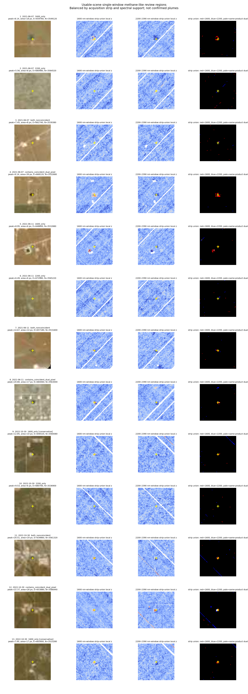

# 雲の少ないHISUIシーンに限定した1600 / 2200 nm単帯域候補の整理

作成日: 2026-08-02

## 結論

`quality_class=usable` の7製品だけを使い、1600 nm側（実際の解析窓は1580–1750 nm）または
2200 nm側（2200–2390 nm）のどちらか一方で局所zが3以上となる領域を再集計した。7製品は
独立な7回観測ではなく、同一撮像の隣接タイルを含むため、投影グリッド上で重複を除くと
2021-06-07、2021-06-11、2022-10-30の3観測ストリップになる。

単帯域条件をそのまま使うと、正側1,847領域に対して、同じ処理を符号反転して作った逆符号
対照が2,199領域だった。したがって、**片方の帯域で3以上になっただけでは、メタンプルーム
検出とは扱えない**。レビュー用に面積、peak、雲距離、形状で絞っても正側243領域、逆符号側
287領域であり、正側だけの増加は見られない。

さらに単帯域だけの候補へ、8画素以上、5以上のcoreが2画素以上、peak 6以上、他方の帯域の
成分内中央値が0以上、雲・QA境界から十分離れる、細い既知ストライプ方向でない、という固定
条件を加えると、正側で残るのは**1600 nmのみの2領域**、逆符号側では
**2200 nmのみの5領域**となった。
2200 nmのみで同じ保守条件を通る正側領域は0である。単帯域だけから確実なプルームを主張
できる結果ではない。



各行は左からpeakを供給した製品のbrowse、観測ストリップunionの1600 nm窓local z、同じ
unionの2200–2390 nm窓local z、union閾値maskである。赤は1600
nm、青は2200–2390 nm、白に近い画素は同一製品の同じ画素で両方が閾値を超えた部分を示す。
別製品が各帯域を供給しただけの同一地上画素は紫になる。画像は各
観測ストリップ・spectral supportごとに上位1領域を選び、候補数の多い2022年シーンだけが
図を占有しないようにしたうえで、固定した保守条件を通る正側2領域は両方を追加した。
`[conservative]` はその条件を通ったことだけを示し、plume確認を意味しない。ここに示すのは
正側のレビュー候補だけであり、正逆対照の全体差は後述の集計表で評価する。

## 1. 対象に残したシーン

`partial` 6製品、`excluded_cloud` 2製品は今回の候補抽出から完全に外した。残した7製品は
すべてQAが揃い、raw cloud proxyは0–0.028%、膨張後cloud率も最大0.213%である。

| 観測日 | 製品タイル | raw cloud率 | 膨張後cloud率 |
|---|---|---:|---:|
| 2021-06-07 | N320W1032 | 0.0280% | 0.2022% |
| 2021-06-07 | N322W1030 | 0.0039% | 0.0270% |
| 2021-06-11 | N320W1033 | 0.0264% | 0.2127% |
| 2021-06-11 | N322W1031 | 0.0125% | 0.0842% |
| 2022-10-30 | N318W1030 | 0% | 0% |
| 2022-10-30 | N320W1032 | 0% | 0% |
| 2022-10-30 | N322W1034 | 0.0054% | 0.0202% |

製品和では10,797,544 analysis-valid画素だが、同一撮像タイルの重複727,041画素を除くと
10,070,503地上画素である。重複率は6.73%である。

## 2. 単帯域maskの定義

方向性ストライプを補正したband $b$ のscoreを $d_b(p)$ とする。既存pipelineと同じ
$\sigma=20$ pixelのGaussian局所統計を使う。$G_\sigma*$ をGaussian畳み込み、$V_b$ を
有限かつanalysis-validな画素maskとして、mask端では

$$
w_b=G_\sigma*V_b,\qquad
\mu_b=\frac{G_\sigma*(V_b d_b)}{w_b},\qquad
m_{2,b}=\frac{G_\sigma*(V_b d_b^2)}{w_b}
$$

と重みを正規化したうえで、

$$
z_b(p)=
\frac{d_b(p)-\mu_b(p)}
{\sqrt{\max\!\left(m_{2,b}(p)-\mu_b(p)^2,10^{-4}\right)}}
$$

を計算済みである。20 m画素なのでGaussianの標準偏差は400 m、2σ半径は約800 mである。
これは局所
contrastのscreening scoreであり、標準正規分布に基づく校正済みp値ではない。

$V_j(p)$ を製品 $j$ の雲・QA・無効DNを除いたanalysis-valid mask、閾値を $\tau=3$ とし、

$$
M_{b,j}^{+}(p)
=\mathbf{1}\!\left[V_j(p)=1\ \land\ z_{b,j}(p)\ge\tau\right]
$$

$$
M_{b,j}^{-}(p)
=\mathbf{1}\!\left[V_j(p)=1\ \land\ -z_{b,j}(p)\ge\tau\right]
$$

とした。$M^-$ はmethane templateと逆向きのtailであり、正側だけに有利な選別をしていないか
調べる対照である。同じUTC分の製品集合を $J_s$ とし、投影画素 $u$ 上で

$$
M_{b,s}^{\pm}(u)=\bigvee_{j\in J_s}M_{b,j}^{\pm}(u)
$$

として重複タイルを1回にまとめた。

両帯域が同じ製品・同じ画素で閾値を超えるmaskは、band別ORの積とは分けて

$$
C_s^{\pm}(u)=
\bigvee_{j\in J_s}
\left[M_{1600,j}^{\pm}(u)\land M_{2200,j}^{\pm}(u)\right]
$$

と定義した。したがって、別製品が1600 nm側と2200–2390 nm側を別々に供給しただけの重なりは
$C_s^{\pm}$ に含めない。

閾値maskの統合はORであり、overlap内の各符号では同じ
地上画素を含む製品の最大local zを、成分のpeak・core数・他帯域中央値、保守判定、順位、
known-site監査、表示に使う。このmax統合は楽観的になり得るため、検出確率には使わない。
UTC分は再現用heuristicであり、公式orbit／strip IDではない。

正側ORと逆符号ORの両方へ入る地上画素が514画素あった。このうち513画素は同一製品内で
1600 nmと2200–2390 nmが逆方向になる帯域間不整合を含み、残る1画素だけが同一製品内の
帯域間不整合では説明されないproduct間不一致だった。これは別々の514検出ではなく、同一
地上画素に正負の相反する支持があることを残す監査値である。

1600または2200 nm maskのORを8近傍でlabelし、少なくとも一方の帯域で3画素以上ある領域を
catalogueへ残した。spectral supportは次の4種類に分けた。

| support | 定義 |
|---|---|
| `1600_only` | 1600 nm側だけが3以上 |
| `2200_only` | 2200–2390 nm側だけが3以上 |
| `both_noncoincident` | 同じ連結領域に両帯域の高値があるが、同一製品・同一画素の重なりはない |
| `contains_coincident_dual_pixel` | 少なくとも1画素で、同一製品内の両帯域が同時に3以上 |

最後の分類も、従来のstrict dual成分と同じではない。従来条件は
$\min(z_{1600},z_{2200})\ge3$ が3画素以上連結することを要求する。

## 3. 全候補と逆符号対照

| 指標 | 正側 | 逆符号側 | 正 / 逆 |
|---|---:|---:|---:|
| 1600 nm tail画素 | 18,563 | 21,653 | 0.857 |
| 1600 nm 3画素以上成分 | 746 | 926 | 0.806 |
| 2200–2390 nm tail画素 | 27,485 | 25,059 | 1.097 |
| 2200–2390 nm 3画素以上成分 | 1,278 | 1,367 | 0.935 |
| strict dual raw tail画素 | 664 | 409 | 1.624 |
| strict dual 3画素以上成分 | 76 | 30 | 2.533 |
| 1600/2200 OR領域 | 1,847 | 2,199 | 0.840 |

strict dualの正側は、同一画素で両帯域が3以上となるraw 664画素のうち、3画素以上の成分に
残る342画素・76成分である。この76成分をより広い単帯域OR領域へ対応付けると73領域になる。
一方、`contains_coincident_dual_pixel` 235領域は1–2画素だけ重なる領域も含むため、これらは
異なる集計単位である（逆符号側はraw 409画素、retained 178画素・30成分、25 OR領域）。
band別strip ORの積には、別製品が各帯域を供給しただけの画素が正側2、逆符号側1画素余分に
あるが、このraw同時閾値数とstrict dualからは除いた。

2200–2390 nmは正側の画素数だけを見ると逆符号より約9.7%多いが、成分数では逆符号の方が
多い。これは少数の大きな正側構造が画素数を押し上げたことを意味し、候補数全体がmethane側へ
偏ったとはいえない。一方、strict dualは正側優勢が残る。ただしこれも多重比較を制御した
probabilityではなく、地表confuserと残留artifactを含む記述統計である。

| 観測ストリップ | 正側OR領域 | 逆符号OR領域 | 正側1600 only | 正側2200 only | 正側両帯隣接 | 正側同一画素重複を含む |
|---|---:|---:|---:|---:|---:|---:|
| 2021-06-07 | 302 | 648 | 124 | 116 | 18 | 44 |
| 2021-06-11 | 385 | 642 | 131 | 163 | 31 | 60 |
| 2022-10-30 | 1,160 | 909 | 239 | 704 | 86 | 131 |
| 合計 | 1,847 | 2,199 | 494 | 983 | 135 | 235 |

正側の単帯域領域が2022-10-30へ集中しているため、7製品で一貫して現れた結果ではない。
2021年の2ストリップでは、逆符号側が正側より大幅に多い。

## 4. 画像確認用shortlist

全1,847領域をplume候補として画像判読するのは不適切なので、次の条件を満たす領域を
`review_shortlist` とした。

- 少なくとも一方の帯域で5画素以上が $z\ge3$
- primary peakが5以上
- elongationが10以下
- 成分全体が膨張後cloudから5画素以上離れる
- 100画素以上かつelongation 10以上のscene-spanning lineでない

この条件では正側243、逆符号側287領域となった。

| support | 正側shortlist | 逆符号shortlist |
|---|---:|---:|
| 1600 only | 33 | 27 |
| 2200 only | 49 | 149 |
| 両帯隣接・非一致 | 26 | 34 |
| 同一画素重複を含む | 135 | 77 |

2200 nm onlyは逆符号側が約3倍多く、単帯域2200 nm候補をそのままmethaneと解釈する根拠は
特に弱い。

### 4.1 単帯域のみの上位領域

座標はEPSG:32613（UTM Zone 13N）のpeak pixel centerである。

| 帯域 | 日付 | Easting | Northing | primary peak z | 面積 | 他帯域peak z | 判定 |
|---|---|---:|---:|---:|---:|---:|---|
| 1600 only | 2022-10-30 | 646760 | 3566020 | 14.938 | 16 px | 1.529 | 他帯域中央値が負、QA境界に近く保守条件外 |
| 1600 only | 2022-10-30 | 646520 | 3560080 | 12.850 | 10 px | 2.812 | 2件のうち高peakの保守的single-window残存領域 |
| 1600 only | 2022-10-30 | 660220 | 3539140 | 9.992 | 48 px | 2.705 | reviewのみ |
| 1600 only | 2022-10-30 | 669740 | 3554760 | 9.569 | 13 px | 1.820 | reviewのみ |
| 2200 only | 2022-10-30 | 680700 | 3536900 | 9.532 | 6 px | −0.678 | 面積不足・他帯域と逆向き |
| 2200 only | 2022-10-30 | 652180 | 3546460 | 8.335 | 12 px | 0.622 | 保守条件外 |
| 2200 only | 2022-10-30 | 652480 | 3546520 | 7.809 | 14 px | 1.345 | 保守条件外 |
| 1600 only | 2022-10-30 | 683900 | 3523280 | 7.004 | 17 px | 2.063 | 2件目の保守的single-window残存領域 |

固定した保守条件をすべて通る正側single-window領域はE=646520 m、N=3560080 mと、E=683900 m、
N=3523280 mの1600 nm候補2件である。前者は3×5 pixel、elongation 1.90の小領域で、他帯域の
成分内中央値は+0.062と0の条件をわずかに通るだけであり、2200–2390 nm peakも2.812で閾値3を
下回る。後者も6×6 pixel、elongation 1.27、2200–2390 nm peak 2.063の小領域である。さらに
逆符号側には同じ保守条件を通る2200 nm only領域が5件あり、2対5の対照結果である。従って、
この2領域も「確認済みplume」ではなく、追加画像判読・全SWIR confuser除去・別日時確認の
対象である。

## 5. R2ガスプラントについて

ここで中心にした座標はTCEQ permit由来のKeystone Gas Plant一般位置proxy
（EPSG:32613、E=685020.9165 m、N=3536104.4465 m）であり、設備単位の排出源座標ではない。
また、このsite中心21×21 pixel正方形は、旧200×200 ROI解析で後から固定した歴史的R2 extent
とは別maskである。旧extentでは2200 nm側の3以上が2画素だったのに対し、今回のsite中心窓
では0画素なので、両者を同一領域の再集計とは扱わない。

2022-10-30のsite中心21×21 pixel窓は441画素すべてanalysis-validで、1600 nm側の3以上は
1画素だけ（peak 3.646）、2200 nm側は0画素（peak 2.574）だった。どちらも3画素連結条件を
満たさない。site座標から最も近い3画素以上成分の最近傍画素までは、1600 nm側で約1.18 km、
2200 nm側で約0.70 kmである。2021年の2ストリップではsite中心窓のanalysis-valid画素が0で、
同地点を評価できない。したがって、単帯域へ緩和してもR2施設が連結候補として再検出された
とはいえない。これらは `single_band_summary.json` の `known_site_audits` に保存した。

## 6. 研究上の判断

今回得られた重要な結果は、「単帯域なら多数の場所が見つかる」こと自体ではなく、逆符号側にも
同程度以上現れることである。意図的に選んだ上位例と保守条件通過例の計13例のbrowseでは、点状地物、道路・pad境界、
残留斜線との重なりがしばしば見えるが、全1,847領域を盲検分類した比率ではない。
単帯域screenは候補を広く拾う一次探索として使える可能性はあるが、recall改善は未検証であり、
結果図の最終色付けやplume確定には使わない。

次に優先する検証は以下である。

1. shortlistを全SWIR／Combo-MFへ通し、道路・施設・鉱物スペクトルとの適合を比較する。
2. CH4 templateを±1–2 bandずらした負対照を同じ候補へ適用する。
3. 風向に沿った細長い形か、同じ地表境界に固定された点・線かを定量化する。
4. E=646520 m、N=3560080 mとE=683900 m、N=3523280 mの2候補を別日の晴天データで確認する。
5. 単帯域候補数ではなく、注入試験で検出率と偽陽性率を測る。

## 7. 再現方法

```powershell
python scripts/summarize_single_band_candidates.py `
  --batch-dir outputs/multiscene_l1g_permian_final_v4 `
  --output-dir outputs/single_band_usable_review_2026-08-02 `
  --threshold 3 `
  --minimum-pixels 3 `
  --gallery-per-support 1 `
  --known-site-csv docs/known_sites_hisui.csv `
  --known-site-id keystone_general `
  --site-radius-pixels 10
```

主な出力は次の通りである。

- `single_band_candidate_regions.csv`: 正側1,847領域の全catalogue
- `single_band_review_shortlist.csv`: 画像確認用243領域
- `single_band_reverse_control_regions.csv`: 逆符号側2,199領域
- `single_band_product_counts.csv`: usable 7製品ごとの単帯域tail集計
- `single_band_summary.json`: 重複除去、条件、集計、R2一般位置proxy監査、生成UTC、script SHA-256を含むprovenance
- `single_band_candidate_gallery.png`: 観測日・supportを均等化した候補画像

結果は候補screenであり、FDR制御済み検出、plume確認、排出源帰属、排出量推定ではない。
