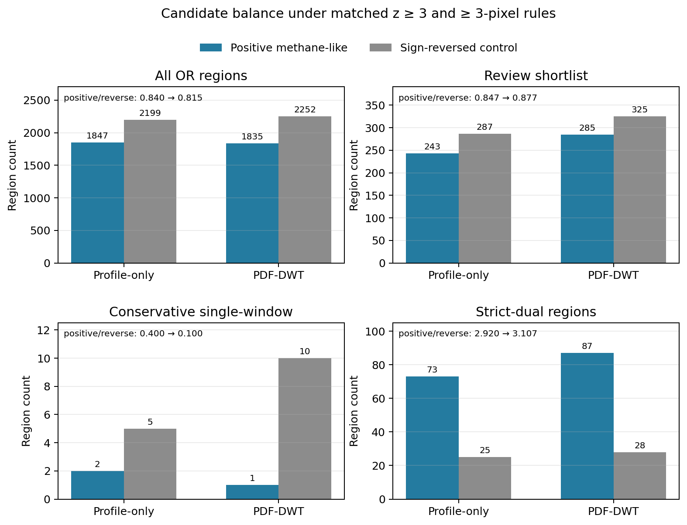
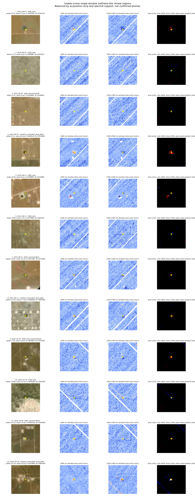
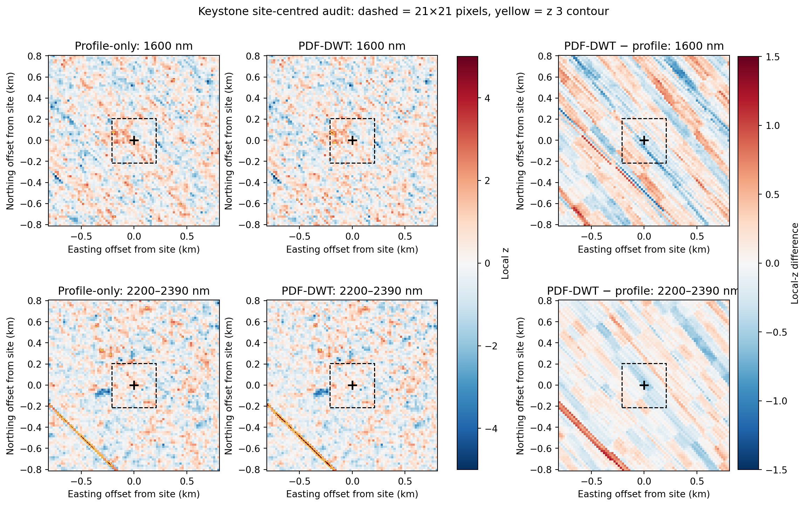
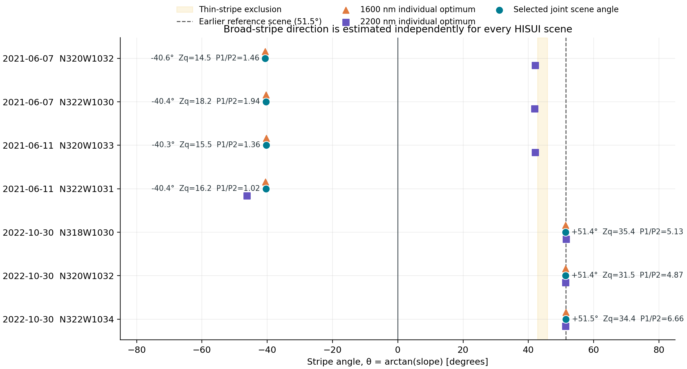
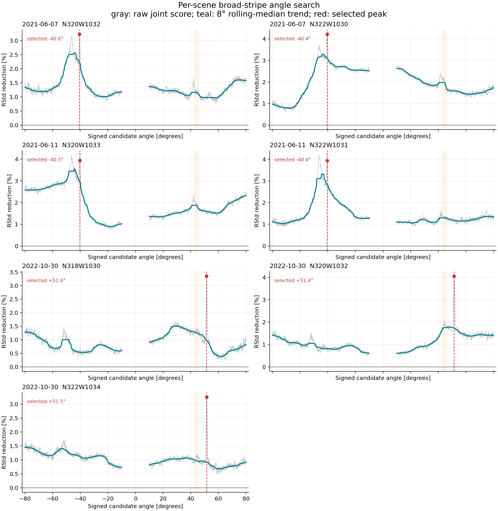
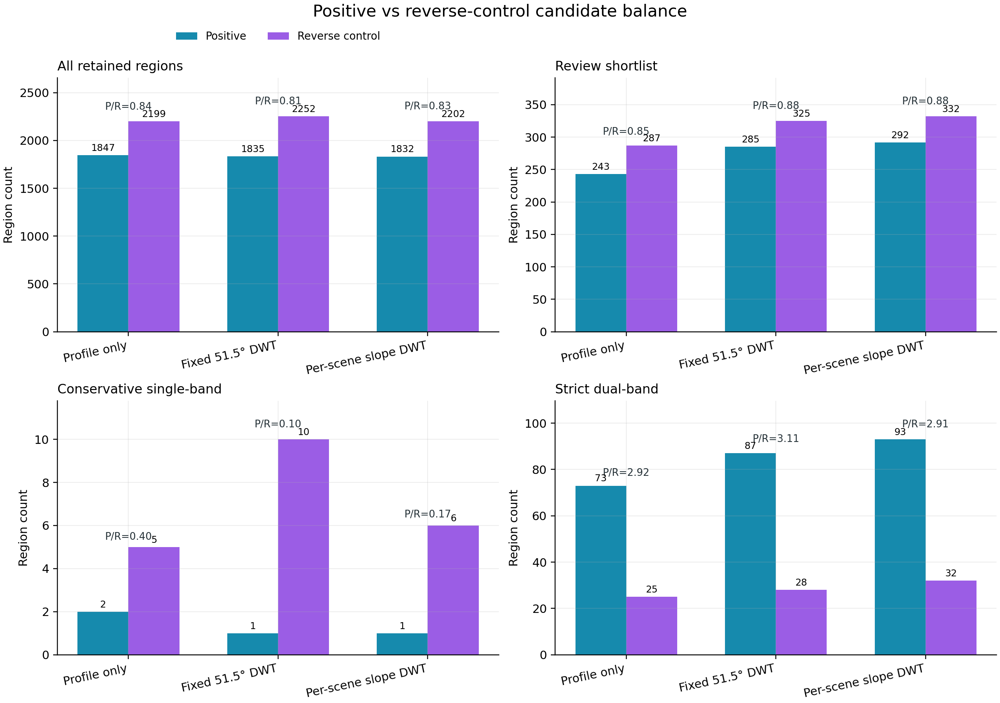
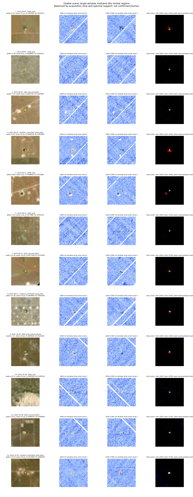
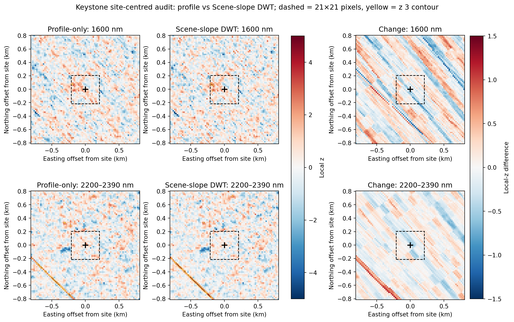

# 雲の少ないHISUIシーンに限定した1600 / 2200 nm単帯域候補の整理

作成日: 2026-08-02
更新日: 2026-08-03（広縞角のシーン別再推定）

第1–7節は従来の固定方向profile補正による主解析、第8節は参照シーンで得た固定角を
全シーンへ適用した履歴的DWT感度解析、第9節は広縞角をシーンごとに再推定した訂正版である。
これらを独立観測の反復とは数えない。

## 結論

`quality_class=usable` の7製品だけを使い、1600 nm側（実際の解析窓は1580–1750 nm）または
2200 nm側（2200–2390 nm）のどちらか一方で局所zが3以上となる領域を再集計した。7製品は
独立な7回観測ではなく、同一撮像の隣接タイルを含むため、投影グリッド上で重複を除くと
2021-06-07、2021-06-11、2022-10-30の3観測ストリップになる。

単帯域条件をそのまま使うと、正側1,847領域に対して、同じ処理を符号反転して作った逆符号
対照が2,199領域だった。したがって、**片方の帯域で3以上になっただけでは、メタンプルーム
検出とは扱えない**。レビュー用に面積、peak、雲距離、形状で絞っても正側243領域、逆符号側
287領域であり、正側だけの増加は見られない。

さらに単帯域だけの候補へ、8画素以上、5以上のcoreが2画素以上、peak 6以上、他方の帯域の
成分内中央値が0以上、雲・QA境界から十分離れる、細い既知ストライプ方向でない、という固定
条件を加えると、正側で残るのは**1600 nmのみの2領域**、逆符号側では
**2200 nmのみの5領域**となった。
2200 nmのみで同じ保守条件を通る正側領域は0である。単帯域だけから確実なプルームを主張
できる結果ではない。

2026-08-03の訂正版では、広縞角を各L1G製品で再推定すると、2021年4製品は
−40.3–−40.6°、2022年3製品は+51.4–+51.5°となった。選択角で測った記述的な広縞profile
RStdは14 scene×band中11で低下したが、角度選択と評価は同じ画像に基づき、正側 / 逆符号
候補比もprofile主解析より一貫して改善しなかった。R2一般位置proxyでは1600 nm側のlocal-zと
閾値画素数だけが増え、2200 nm支持は0画素のままである。したがってシーン別DWTも探索的な
感度分岐に留め、メタン検出の主結果は上記profile解析の結論から変更しない。


各行は左からpeakを供給した製品のbrowse、観測ストリップunionの1600 nm窓local z、同じ
unionの2200–2390 nm窓local z、union閾値maskである。赤は1600
nm、青は2200–2390 nm、白に近い画素は同一製品の同じ画素で両方が閾値を超えた部分を示す。
別製品が各帯域を供給しただけの同一地上画素は紫になる。画像は各
観測ストリップ・spectral supportごとに上位1領域を選び、候補数の多い2022年シーンだけが
図を占有しないようにしたうえで、固定した保守条件を通る正側2領域は両方を追加した。
`[conservative]` はその条件を通ったことだけを示し、plume確認を意味しない。ここに示すのは
正側のレビュー候補だけであり、正逆対照の全体差は後述の集計表で評価する。

## 1. 対象に残したシーン

`partial` 6製品、`excluded_cloud` 2製品は今回の候補抽出から完全に外した。残した7製品は
すべてQAが揃い、raw cloud proxyは0–0.028%、膨張後cloud率も最大0.213%である。

| 観測日 | 製品タイル | raw cloud率 | 膨張後cloud率 |
|---|---|---:|---:|
| 2021-06-07 | N320W1032 | 0.0280% | 0.2022% |
| 2021-06-07 | N322W1030 | 0.0039% | 0.0270% |
| 2021-06-11 | N320W1033 | 0.0264% | 0.2127% |
| 2021-06-11 | N322W1031 | 0.0125% | 0.0842% |
| 2022-10-30 | N318W1030 | 0% | 0% |
| 2022-10-30 | N320W1032 | 0% | 0% |
| 2022-10-30 | N322W1034 | 0.0054% | 0.0202% |

製品和では10,797,544 analysis-valid画素だが、同一撮像タイルの重複727,041画素を除くと
10,070,503地上画素である。重複率は6.73%である。

## 2. 単帯域maskの定義

方向性ストライプを補正したband $b$ のscoreを $d_b(p)$ とする。既存pipelineと同じ
$\sigma=20$ pixelのGaussian局所統計を使う。$G_\sigma*$ をGaussian畳み込み、$V_b$ を
有限かつanalysis-validな画素maskとして、mask端では

$$
w_b=G_\sigma*V_b,\qquad
\mu_b=\frac{G_\sigma*(V_b d_b)}{w_b},\qquad
m_{2,b}=\frac{G_\sigma*(V_b d_b^2)}{w_b}
$$

と重みを正規化したうえで、

$$
z_b(p)=
\frac{d_b(p)-\mu_b(p)}
{\sqrt{\max\!\left(m_{2,b}(p)-\mu_b(p)^2,10^{-4}\right)}}
$$

を計算済みである。20 m画素なのでGaussianの標準偏差は400 m、2σ半径は約800 mである。
これは局所
contrastのscreening scoreであり、標準正規分布に基づく校正済みp値ではない。

$V_j(p)$ を製品 $j$ の雲・QA・無効DNを除いたanalysis-valid mask、閾値を $\tau=3$ とし、

$$
M_{b,j}^{+}(p)
=\mathbf{1}\!\left[V_j(p)=1\ \land\ z_{b,j}(p)\ge\tau\right]
$$

$$
M_{b,j}^{-}(p)
=\mathbf{1}\!\left[V_j(p)=1\ \land\ -z_{b,j}(p)\ge\tau\right]
$$

とした。$M^-$ はmethane templateと逆向きのtailであり、正側だけに有利な選別をしていないか
調べる対照である。同じUTC分の製品集合を $J_s$ とし、投影画素 $u$ 上で

$$
M_{b,s}^{\pm}(u)=\bigvee_{j\in J_s}M_{b,j}^{\pm}(u)
$$

として重複タイルを1回にまとめた。

両帯域が同じ製品・同じ画素で閾値を超えるmaskは、band別ORの積とは分けて

$$
C_s^{\pm}(u)=
\bigvee_{j\in J_s}
\left[M_{1600,j}^{\pm}(u)\land M_{2200,j}^{\pm}(u)\right]
$$

と定義した。したがって、別製品が1600 nm側と2200–2390 nm側を別々に供給しただけの重なりは
$C_s^{\pm}$ に含めない。

閾値maskの統合はORであり、overlap内の各符号では同じ
地上画素を含む製品の最大local zを、成分のpeak・core数・他帯域中央値、保守判定、順位、
known-site監査、表示に使う。このmax統合は楽観的になり得るため、検出確率には使わない。
UTC分は再現用heuristicであり、公式orbit／strip IDではない。

正側ORと逆符号ORの両方へ入る地上画素が514画素あった。このうち513画素は同一製品内で
1600 nmと2200–2390 nmが逆方向になる帯域間不整合を含み、残る1画素だけが同一製品内の
帯域間不整合では説明されないproduct間不一致だった。これは別々の514検出ではなく、同一
地上画素に正負の相反する支持があることを残す監査値である。

1600または2200 nm maskのORを8近傍でlabelし、少なくとも一方の帯域で3画素以上ある領域を
catalogueへ残した。spectral supportは次の4種類に分けた。

| support | 定義 |
|---|---|
| `1600_only` | 1600 nm側だけが3以上 |
| `2200_only` | 2200–2390 nm側だけが3以上 |
| `both_noncoincident` | 同じ連結領域に両帯域の高値があるが、同一製品・同一画素の重なりはない |
| `contains_coincident_dual_pixel` | 少なくとも1画素で、同一製品内の両帯域が同時に3以上 |

最後の分類も、従来のstrict dual成分と同じではない。従来条件は
$\min(z_{1600},z_{2200})\ge3$ が3画素以上連結することを要求する。

## 3. 全候補と逆符号対照

| 指標 | 正側 | 逆符号側 | 正 / 逆 |
|---|---:|---:|---:|
| 1600 nm tail画素 | 18,563 | 21,653 | 0.857 |
| 1600 nm 3画素以上成分 | 746 | 926 | 0.806 |
| 2200–2390 nm tail画素 | 27,485 | 25,059 | 1.097 |
| 2200–2390 nm 3画素以上成分 | 1,278 | 1,367 | 0.935 |
| strict dual raw tail画素 | 664 | 409 | 1.624 |
| strict dual 3画素以上成分 | 76 | 30 | 2.533 |
| 1600/2200 OR領域 | 1,847 | 2,199 | 0.840 |

strict dualの正側は、同一画素で両帯域が3以上となるraw 664画素のうち、3画素以上の成分に
残る342画素・76成分である。この76成分をより広い単帯域OR領域へ対応付けると73領域になる。
一方、`contains_coincident_dual_pixel` 235領域は1–2画素だけ重なる領域も含むため、これらは
異なる集計単位である（逆符号側はraw 409画素、retained 178画素・30成分、25 OR領域）。
band別strip ORの積には、別製品が各帯域を供給しただけの画素が正側2、逆符号側1画素余分に
あるが、このraw同時閾値数とstrict dualからは除いた。

2200–2390 nmは正側の画素数だけを見ると逆符号より約9.7%多いが、成分数では逆符号の方が
多い。これは少数の大きな正側構造が画素数を押し上げたことを意味し、候補数全体がmethane側へ
偏ったとはいえない。一方、strict dualは正側優勢が残る。ただしこれも多重比較を制御した
probabilityではなく、地表confuserと残留artifactを含む記述統計である。

| 観測ストリップ | 正側OR領域 | 逆符号OR領域 | 正側1600 only | 正側2200 only | 正側両帯隣接 | 正側同一画素重複を含む |
|---|---:|---:|---:|---:|---:|---:|
| 2021-06-07 | 302 | 648 | 124 | 116 | 18 | 44 |
| 2021-06-11 | 385 | 642 | 131 | 163 | 31 | 60 |
| 2022-10-30 | 1,160 | 909 | 239 | 704 | 86 | 131 |
| 合計 | 1,847 | 2,199 | 494 | 983 | 135 | 235 |

正側の単帯域領域が2022-10-30へ集中しているため、7製品で一貫して現れた結果ではない。
2021年の2ストリップでは、逆符号側が正側より大幅に多い。

## 4. 画像確認用shortlist

全1,847領域をplume候補として画像判読するのは不適切なので、次の条件を満たす領域を
`review_shortlist` とした。

- 少なくとも一方の帯域で5画素以上が $z\ge3$
- primary peakが5以上
- elongationが10以下
- 成分全体が膨張後cloudから5画素以上離れる
- 100画素以上かつelongation 10以上のscene-spanning lineでない

この条件では正側243、逆符号側287領域となった。

| support | 正側shortlist | 逆符号shortlist |
|---|---:|---:|
| 1600 only | 33 | 27 |
| 2200 only | 49 | 149 |
| 両帯隣接・非一致 | 26 | 34 |
| 同一画素重複を含む | 135 | 77 |

2200 nm onlyは逆符号側が約3倍多く、単帯域2200 nm候補をそのままmethaneと解釈する根拠は
特に弱い。

### 4.1 単帯域のみの上位領域

座標はEPSG:32613（UTM Zone 13N）のpeak pixel centerである。

| 帯域 | 日付 | Easting | Northing | primary peak z | 面積 | 他帯域peak z | 判定 |
|---|---|---:|---:|---:|---:|---:|---|
| 1600 only | 2022-10-30 | 646760 | 3566020 | 14.938 | 16 px | 1.529 | 他帯域中央値が負、QA境界に近く保守条件外 |
| 1600 only | 2022-10-30 | 646520 | 3560080 | 12.850 | 10 px | 2.812 | 2件のうち高peakの保守的single-window残存領域 |
| 1600 only | 2022-10-30 | 660220 | 3539140 | 9.992 | 48 px | 2.705 | reviewのみ |
| 1600 only | 2022-10-30 | 669740 | 3554760 | 9.569 | 13 px | 1.820 | reviewのみ |
| 2200 only | 2022-10-30 | 680700 | 3536900 | 9.532 | 6 px | −0.678 | 面積不足・他帯域と逆向き |
| 2200 only | 2022-10-30 | 652180 | 3546460 | 8.335 | 12 px | 0.622 | 保守条件外 |
| 2200 only | 2022-10-30 | 652480 | 3546520 | 7.809 | 14 px | 1.345 | 保守条件外 |
| 1600 only | 2022-10-30 | 683900 | 3523280 | 7.004 | 17 px | 2.063 | 2件目の保守的single-window残存領域 |

固定した保守条件をすべて通る正側single-window領域はE=646520 m、N=3560080 mと、E=683900 m、
N=3523280 mの1600 nm候補2件である。前者は3×5 pixel、elongation 1.90の小領域で、他帯域の
成分内中央値は+0.062と0の条件をわずかに通るだけであり、2200–2390 nm peakも2.812で閾値3を
下回る。後者も6×6 pixel、elongation 1.27、2200–2390 nm peak 2.063の小領域である。さらに
逆符号側には同じ保守条件を通る2200 nm only領域が5件あり、2対5の対照結果である。従って、
この2領域も「確認済みplume」ではなく、追加画像判読・全SWIR confuser除去・別日時確認の
対象である。

## 5. R2ガスプラントについて

ここで中心にした座標はTCEQ permit由来のKeystone Gas Plant一般位置proxy
（EPSG:32613、E=685020.9165 m、N=3536104.4465 m）であり、設備単位の排出源座標ではない。
また、このsite中心21×21 pixel正方形は、旧200×200 ROI解析で後から固定した歴史的R2 extent
とは別maskである。旧extentでは2200 nm側の3以上が2画素だったのに対し、今回のsite中心窓
では0画素なので、両者を同一領域の再集計とは扱わない。

2022-10-30のsite中心21×21 pixel窓は441画素すべてanalysis-validで、1600 nm側の3以上は
1画素だけ（peak 3.646）、2200 nm側は0画素（peak 2.574）だった。どちらも3画素連結条件を
満たさない。site座標から最も近い3画素以上成分の最近傍画素までは、1600 nm側で約1.18 km、
2200 nm側で約0.70 kmである。2021年の2ストリップではsite中心窓のanalysis-valid画素が0で、
同地点を評価できない。したがって、単帯域へ緩和してもR2施設が連結候補として再検出された
とはいえない。これらは `single_band_summary.json` の `known_site_audits` に保存した。

## 6. 研究上の判断

今回得られた重要な結果は、「単帯域なら多数の場所が見つかる」こと自体ではなく、逆符号側にも
同程度以上現れることである。意図的に選んだ上位例と保守条件通過例の計13例のbrowseでは、点状地物、道路・pad境界、
残留斜線との重なりがしばしば見えるが、全1,847領域を盲検分類した比率ではない。
単帯域screenは候補を広く拾う一次探索として使える可能性はあるが、recall改善は未検証であり、
結果図の最終色付けやplume確定には使わない。

次に優先する検証は以下である。

1. shortlistを全SWIR／Combo-MFへ通し、道路・施設・鉱物スペクトルとの適合を比較する。
2. CH4 templateを±1–2 bandずらした負対照を同じ候補へ適用する。
3. 風向に沿った細長い形か、同じ地表境界に固定された点・線かを定量化する。
4. E=646520 m、N=3560080 mとE=683900 m、N=3523280 mの2候補を別日の晴天データで確認する。
5. 単帯域候補数ではなく、注入試験で検出率と偽陽性率を測る。

## 7. 再現方法

```powershell
python scripts/summarize_single_band_candidates.py `
  --batch-dir outputs/multiscene_l1g_permian_final_v4 `
  --output-dir outputs/single_band_usable_review_2026-08-02 `
  --threshold 3 `
  --minimum-pixels 3 `
  --gallery-per-support 1 `
  --known-site-csv docs/known_sites_hisui.csv `
  --known-site-id keystone_general `
  --site-radius-pixels 10
```

主な出力は次の通りである。

- `single_band_candidate_regions.csv`: 正側1,847領域の全catalogue
- `single_band_review_shortlist.csv`: 画像確認用243領域
- `single_band_reverse_control_regions.csv`: 逆符号側2,199領域
- `single_band_product_counts.csv`: usable 7製品ごとの単帯域tail集計
- `single_band_summary.json`: 重複除去、条件、集計、R2一般位置proxy監査、生成UTC、script SHA-256を含むprovenance
- `single_band_candidate_gallery.png`: 観測日・supportを均等化した候補画像

結果は候補screenであり、FDR制御済み検出、plume確認、排出源帰属、排出量推定ではない。

## 8. PDF記載のDWT→median再解析（固定角を用いた履歴的解析）

### 8.1 再解析の位置づけ

提供PDFに記録された処理順を、同じ7 usable製品の**未補正MF score**から別分岐として
再実行した。従来のprofile補正済み画像へDWTを重ねてはいない。広い縞の傾き

$$
a_b=1.257172298918948
$$

はCT方向ではなく、PDFで画像から独立に求めた固定値である。今回の7製品に合わせて
再最適化していない。細い縞にはQA traceから得た別の固定傾き

$$
a_t=0.9773460526106752
$$

を使った。したがって、処理順は

$$
\text{raw MF}
\longrightarrow
\text{broad DWT at }a_b
\longrightarrow
\text{thin line median at }a_t
\longrightarrow
\text{local }z
$$

であり、広縞と細縞を同じCT傾きで補正する方法ではない。

### 8.2 候補保護mask

弱帯・強帯それぞれのraw scoreから、2節と同じ局所標準化で $r_b$ を求めた。保護maskは
正側だけを優遇しないよう絶対値を使い、両帯域で共通に固定した。

$$
P_0=
\bigcup_{b\in\{1600,2200\}}
\left[
\{|r_b|\ge4\}
\cup
\operatorname{CC}_{\ge3}\{|r_b|\ge3\}
\right]
$$

$$
P=\operatorname{dilate}_2(P_0)
$$

$\operatorname{CC}_{\ge3}$ は8近傍で3画素以上の成分だけを残す演算である。$P$ はDWT前に
一度だけ作り、弱帯・強帯、正側・逆符号側で共有した。DWTへ渡す数値画像では保護位置を
最近傍の非保護値で一時的に埋めるが、後述の閾値推定supportからは除く。推定されたstripe
成分は保護位置からも差し引くため、これは「候補画素を不変に凍結するmask」ではない。

### 8.3 support-aware Haar DWT

画像座標の行 $p_y$ は下向きに増えるため、

$$
b=p_y-a_b p_x,
\qquad
\theta_b=\arctan(a_b)=+51.5^\circ
$$

だけSciPy画像を回転すると、広い縞が水平detailへ対応する。逆回転は $-51.5^\circ$ である。
各全景を回転しても元画像が切れず、かつ $2^6$ で割り切れる中央canvasは2624×2624画素と
した。数値画像の外側はreflect paddingする一方、valid supportの外側は0として別に回転した。

回転画像 $R_{\theta_b}d$ の6段Haar分解を

$$
W(R_{\theta_b}d)
=
\left(A_6,\{H_\ell,V_\ell,D_\ell\}_{\ell=1}^{6}\right)
$$

とする。係数 $k$ のfootprintにおける回転後valid coverage平均を $v_{\ell k}$、validかつ
非保護coverage平均を $u_{\ell k}$ とした。閾値推定は

$$
E_{\ell k}=\mathbf 1[u_{\ell k}=1]
$$

すなわち100% validかつ非保護の係数だけで行い、補正適用は

$$
A_{\ell k}=\mathbf 1[v_{\ell k}\ge0.95]
$$

とした。この分離により、無効画素、保護画素、reflect paddingがDWT閾値を決めることを
避けた。level 3–5の水平detailだけについて、$|H_\ell|$ と $|V_\ell|$ のヒストグラム差から
scene・band・levelごとに $T_\ell$ を求め、

$$
\lambda_\ell=0.75T_\ell
$$

$$
\widetilde H_{\ell k}=
\begin{cases}
\operatorname{sign}(H_{\ell k})
\max(|H_{\ell k}|-\lambda_\ell,0),&A_{\ell k}=1,\\
H_{\ell k},&A_{\ell k}=0
\end{cases}
$$

とsoft-thresholdした。$V_\ell,D_\ell$ とlevel 1、2、6は変更しない。20 m画素ではlevel
3、4、5のsupportはそれぞれ約160、320、640 mであり、想定プルーム尺度とも重なる。

完全supportで閾値推定に使えた係数数はlevel 3で18,018–19,186、level 4で
3,253–3,585、level 5で311–381だった。level 5は128 binに対して1 bin平均2.4–3.0係数しか
ない。そこで、500係数未満なら停止する版と、PDFどおりlevel 5まで通すため下限を300にした
版を両方残し、後者だけを唯一の確定設定とは扱わない。

### 8.4 細い縞のline median

DWT後のscoreを $d_{\mathrm{DWT}}$ とし、追加で1画素膨張した保護mask
$P_t=\operatorname{dilate}_1(P)$ を除外して、

$$
k(p)=
\operatorname{round}
\left(
\frac{p_y-a_t p_x}{2}
\right)
$$

により幅2画素の線へ分けた。各線のoffsetは

$$
o_k=
\operatorname{median}_{q:k(q)=k,\,V(q)=1,\,P_t(q)=0}
d_{\mathrm{DWT}}(q)
-
\operatorname{median}_{q:V(q)=1,\,P_t(q)=0}
d_{\mathrm{DWT}}(q)
$$

であり、最終scoreは

$$
d_{\mathrm{final}}(p)=d_{\mathrm{DWT}}(p)-o_{k(p)}
$$

とした。非保護画素が5未満の線では、保護画素をfallbackへ混ぜず、隣接する有効線の
offsetを補間した。最後に $d_{\mathrm{final}}$ から局所zを再計算し、第2–4節と全く同じ
$z\ge3$、3画素以上、正負対称の候補規則へ通した。

### 8.5 全景候補の結果

| 指標 | 従来profile補正 | 完全support L3–4（下限500） | 完全support L3–5（下限300） |
|---|---:|---:|---:|
| 正側 / 逆符号 OR領域 | 1,847 / 2,199 | 1,849 / 2,233 | 1,835 / 2,252 |
| 正 / 逆比 | 0.840 | 0.828 | 0.815 |
| shortlist | 243 / 287 | 272 / 313 | 285 / 325 |
| 保守的single-window | 2 / 5 | 1 / 9 | 1 / 10 |
| strict-dual OR領域 | 73 / 25 | 85 / 28 | 87 / 28 |



level 5を止めても通しても、全OR領域と保守候補では逆符号対照が正側以上に残った。
strict dualの正 / 逆比は2.920から3.107へ増えたが、FDR校正済み検出ではなく、正負双方の
tailと地表・線状artifactを含むため、これだけをDWTの性能向上とは解釈しない。

従来補正後と最終DWT補正後の方向profile robust standard deviationを14 scene×bandで
比較すると、広縞方向は改善3、悪化11で、相対変化の中央値は**+22.7%**だった。細縞方向は
改善12、悪化2で、中央値は**−14.0%**だった。後段の細線medianは多くの画像で機能したが、
広縞DWTは従来profile subtractionを上回らなかった。

PDF-DWT後に保守条件を通る正側は、2022-10-30のE=683900 m、N=3523280 mにある
`1600_only` 1領域だけだった。面積19画素、$z\ge5$ core 8画素、peak 7.286で、2200 nm
peakは2.060である。従来補正でも同じ場所が面積17画素、peak 7.004で残っていた。
もう1件の従来保守候補E=646520 m、N=3560080 mは、DWT後に1600 nm 14画素と2200 nm
1画素の`both_noncoincident`となった。同一画素での両帯域重複は0なので、dual確認ではない。



このgalleryは旧図と同じ位置を固定したbefore / afterではなく、各補正後に観測ストリップと
spectral supportごとに候補を再選択したcatalogueである。複数panelに長い斜線が残るため、
画像上位値だけをplumeと読まない。

### 8.6 R2一般位置proxyの結果

2022-10-30のKeystone Gas Plant一般位置を中心とする21×21画素監査窓を、同じ地上座標・
同じ色軸で比較した。

| 指標 | 従来profile補正 | PDF-DWT L3–5 |
|---|---:|---:|
| 1600 nm $z\ge3$ | 1画素 | 5画素 |
| 1600 nm peak | 3.646 | 3.965 |
| 2200–2390 nm $z\ge3$ | 0画素 | 0画素 |
| 2200–2390 nm peak | 2.574 | 2.568 |
| dual peak | 1.955 | 2.002 |
| 最近傍1600 nm retained成分まで | 1.18 km | 189 m |



破線がsite中心21×21画素窓、黒い十字が一般位置proxy、黄色が $z=3$ contourである。
DWT後の1600 nm側5画素は8近傍で3画素と2画素に分かれ、保持されるのは最小条件ちょうどの
3画素成分だけだった。そのpeakはsiteから約215 m、最近傍画素は189 mで、peak 3.965、
$z\ge5$ core 0、2200 nm counterpart peak 0.704、shortlist外である。したがって、
R2近傍の弱帯局所高値への感度は上がったが、**2200 nm支持を伴うメタン再検出ではない**。
差分画像に広い斜め構造が見えることからも、この変化は前処理依存として扱う。

### 8.7 研究上の判断と次の検証

この固定角解析だけを見ると、広縞profileと逆符号対照は従来法より改善しなかった。
ただし、後続の第9節で判明したとおり、広縞角1.2571723（51.5°）は参照シーンの値であり、
2021年シーンへ固定適用したこと自体が不適切だった。このため、本節の「広縞DWTが無効」
という判断は一般化せず、固定角適用に対する履歴的な感度結果としてだけ残す。

level 3–5は160–640 mのプルーム尺度と重なる。低振幅プルームは保護maskへ入らない可能性が
あるため、補正法の採択前に、MODTRAN log-radiance差をMF前の実HISUI放射輝度へ加えるpaired
注入試験が必要である。背景MF modelを注入前に固定し、stripe平行・直交・ランダム方向、
160 / 320 / 640 m尺度を含め、少なくとも次を確認する。

- 同じ経験的false-positive rateでの検出率低下が5 percentage points以内
- peak・積分信号の中央値保持率が0.9–1.1、下位10%保持率が0.8以上
- 重心誤差の増加が1画素以内
- 逆符号成分密度が増えない
- level 5の閾値をbootstrapしたときの変動係数が10%以内

既存200×200 ROIのMODTRAN注入はfull-scene DWT、level 5 support、候補保護maskを通して
いないため、この採択判定の代用にはしない。

### 8.8 再現方法

PDFどおりlevel 3–5を実行する完全support版は次で再現できる。

```powershell
python scripts/postprocess_score_maps_pdf_dwt.py `
  --source-batch outputs/multiscene_l1g_permian_final_v4 `
  --output-batch outputs/multiscene_l1g_permian_pdf_dwt_v3 `
  --minimum-threshold-coefficients 300

python scripts/summarize_single_band_candidates.py `
  --batch-dir outputs/multiscene_l1g_permian_pdf_dwt_v3 `
  --output-dir outputs/single_band_usable_review_pdf_dwt_v3_2026-08-02 `
  --threshold 3 --minimum-pixels 3 --gallery-per-support 1 `
  --known-site-csv docs/known_sites_hisui.csv `
  --known-site-id keystone_general --site-radius-pixels 10

python scripts/compare_pdf_dwt_reanalysis.py `
  --profile-summary outputs/single_band_usable_review_2026-08-02/single_band_summary.json `
  --pdf-summary outputs/single_band_usable_review_pdf_dwt_v3_2026-08-02/single_band_summary.json `
  --profile-batch outputs/multiscene_l1g_permian_final_v4 `
  --pdf-batch outputs/multiscene_l1g_permian_pdf_dwt_v3 `
  --posthoc-summary outputs/multiscene_l1g_permian_pdf_dwt_v3/posthoc_pdf_dwt_summary.json `
  --known-site-csv docs/known_sites_hisui.csv `
  --known-site-id keystone_general `
  --output-dir outputs/pdf_dwt_reanalysis_v3_2026-08-02
```

level 5を停止する感度解析は、最初のコマンドの出力先を別名にし、
`--minimum-threshold-coefficients 500` として同じ集計へ通す。元のscore mapsは変更せず、
派生batchのmanifest、script SHA-256、入力hash、scene・band・level別thresholdとsupport数を保存する。

## 9. 広縞傾きをシーンごとに求めたDWT再解析

### 9.1 訂正点と解析単位

広縞の傾きは、**各L1G製品を1シーンとして、シーンごとに独立推定する**よう修正した。
第8節の $a_b=1.2571723$ は2022-10-30の参照シーンで得た値であり、全期間に共通する
装置定数ではない。同じシーン内ではストライプの幾何を恣意的に変えないため、推定した
1本の符号付き傾きを1600 nm・2200 nmの両方、正側・逆符号対照の両方へ共通適用した。
帯域ごと、候補の符号ごとに最適角を選び直してはいない。



### 9.2 シーン別傾きの推定式

シーンを $s$、吸収帯を $c\in\{1600,2200\}$、未補正MF scoreを $d_{s,c}(p)$ とする。
候補保護mask $P_s$ は8.2節と同じ正負対称・両帯域共通の定義で、角度探索より前に固定した。
候補角 $\theta$ ごとに画素を幅18画素の平行線へ割り当てる。

$$
a(\theta)=\tan\theta,
\qquad
k_{s,\theta}(p)=
\operatorname{round}\!\left(
\frac{p_y-a(\theta)p_x}{18}
\right)
$$

valid maskを $V_s$ とする。各線の一時offsetは、validかつ非保護のsampled画素だけから

$$
m_{s,c,k}(\theta)=
\operatorname{median}_{p:\,k_{s,\theta}(p)=k,\,V_s(p)=1,\,P_s(p)=0}
d_{s,c}(p)
$$

を求める。sample grid上で20点以上あるline集合を $\mathcal G_s(\theta)$ として、

$$
o_{s,c,k}(\theta)=
m_{s,c,k}(\theta)
-
\operatorname{median}_{k'\in\mathcal G_s(\theta)}m_{s,c,k'}(\theta),
\qquad k\in\mathcal G_s(\theta)
$$

とした。support不足lineは探索score計算ではoffset 0とする。
$\operatorname{RStd}(x)=1.4826\operatorname{median}|x-\operatorname{median}(x)|$
（0なら通常の標準偏差へfallback）として、帯域別scoreを

$$
g_{s,c}(\theta)=
\frac{
\operatorname{RStd}(d_{s,c})-
\operatorname{RStd}\!\left(
d_{s,c}(p)-o_{s,c,k_{s,\theta}(p)}(\theta)
\right)
}{
\operatorname{RStd}(d_{s,c})
}
$$

で定義した。これは、その角度のline-medianを仮に引いたときrobust dispersionが何割減るかを
表す。式中のRStdもvalidかつ非保護のsampled画素上で評価する。弱帯・強帯のscore scale差が
選択を支配しないよう、絶対減少量ではなく相対減少率を平均した。

$$
g_s(\theta)=\frac{g_{s,1600}(\theta)+g_{s,2200}(\theta)}{2}
$$

正角・負角の枝ごとに8°幅のrolling median $M_8[g_s](\theta)$ を求め、局所prominenceを

$$
q_s(\theta)=g_s(\theta)-M_8[g_s](\theta)
$$

とした。探索端1°を除き、$\pm1^\circ$ 近傍で局所最大となる正の $q_s$ のうち最大を暫定角
$\widehat\theta_s$ とする。細縞方向 $+44.3436^\circ$ の前後1.5°は、同じ構造を広縞として
二重選択しないため除外した。さらに、許容角全体でのprominenceのrobust scaleを使い、

$$
Z_{q,s}=\frac{q_s(\widehat\theta_s)}{\operatorname{RStd}_{\theta}[q_s(\theta)]}
$$

を計算した。正の局所peak、joint gainと両帯域gainが正、support lineあり、探索端でない、
$Z_{q,s}\ge5$ をすべて満たす場合だけ `supported` とし、それ以外では広縞DWTをskipする。
これは無縞ノイズへ常にDWTをかけないための暫定的な安全gateであり、校正済みp値ではない。

実装設定は次のとおりである。

| 項目 | 設定 |
|---|---:|
| 符号付き角度探索 | $-80$–$-10^\circ$, $+10$–$+80^\circ$ |
| 角度step | $0.1^\circ$ |
| line幅 | 18画素 |
| 画像sample step | 4画素 |
| 1 lineの最小support | sampled gridで20点（設定値80をsample step 4で除した実装） |
| angular trend窓 | 8° |
| local-peak窓 | $\pm1^\circ$ |
| 探索端除外 | 1° |
| 細縞方向除外 | $44.3436\pm1.5^\circ$ |
| 暫定no-stripe gate | prominence robust z $\ge5$、両帯域gain $>0$ |

全角度のraw score、rolling trend、prominence、選択フラグはシーン別CSVとbatch統合CSVへ
保存した。検索曲線を図示すると、2021年と2022年で異なる符号の山が選ばれている。ただし、
約1,400候補角から同じ画像上の最大prominenceを選ぶため、$Z_{q,s}\ge5$ もlook-elsewhereを
補正した有意閾値ではない。第1 / 第2 prominence比も信頼区間ではない。



### 9.3 推定された傾き

| 観測日 | 製品タイル | 選択角 $\widehat\theta_s$ | 傾き $\tan\widehat\theta_s$ | joint相対RStd減少 | 1600 / 2200 nm個別peak角 | 第1 / 第2 prominence |
|---|---|---:|---:|---:|---:|---:|
| 2021-06-07 | N320W1032 | −40.6° | −0.8571 | 3.23% | −40.6° / +42.1° | 1.46 |
| 2021-06-07 | N322W1030 | −40.4° | −0.8511 | 4.22% | −40.4° / +41.9° | 1.94 |
| 2021-06-11 | N320W1033 | −40.3° | −0.8481 | 3.94% | −40.3° / +42.1° | 1.36 |
| 2021-06-11 | N322W1031 | −40.4° | −0.8511 | 3.93% | −40.5° / −46.2° | 1.02 |
| 2022-10-30 | N318W1030 | +51.4° | +1.2527 | 3.35% | +51.4° / +51.6° | 5.13 |
| 2022-10-30 | N320W1032 | +51.4° | +1.2527 | 4.05% | +51.4° / +51.4° | 4.87 |
| 2022-10-30 | N322W1034 | +51.5° | +1.2572 | 3.26% | +51.5° / +51.4° | 6.66 |

各製品を独立に探索したにもかかわらず、同一観測内のrangeは2021-06-07で0.2°、
2021-06-11で0.1°、2022-10-30で0.1°だった。共通する観測時の縞幾何を拾った可能性を
支持するが、隣接tileに共通する地表・処理構造の影響もあり、独立な証明ではない。一方、
2021年は第1 / 第2 prominence比が1.02–1.94と低く、1600 / 2200 nm個別peak角は全4製品で
一致しない。3製品は反対符号で82.3–82.7°離れ、残る1製品も5.7°差だった。したがって
2021年角には大きな不確かさがあり、joint角は「確定値」でなく探索を安定化する暫定値とする。
今回の7製品は $Z_{q,s}=14.5$–$35.4$ で暫定gateをすべて通り、選択角と第9.4–9.6節の数値は
gate追加前から変わらなかった。

### 9.4 シーン別角でのDWT結果

選択した $\widehat\theta_s$ で8.3節と同じsupport-aware Haar DWT level 3–5を行い、
その後に細縞傾き0.9773461のline medianを適用した。候補領域の
`shape_stripe_direction_flag` も、固定51.5°ではなく、その領域へ寄与し、かつ `supported` と
なった各シーンの $\widehat\theta_s$ と細縞方向だけに対して判定するよう更新した。CSVには
最も近い方向、角度差、製品ID、slope statusを保存する。

従来profile補正画像と比較した方向profile RStdは次のとおりである。

| DWTの広縞角 | 広縞profile 低下 / 増加（14 scene×band） | 広縞RStd相対変化中央値 | 細縞profile 低下 / 増加 | 細縞RStd相対変化中央値 |
|---|---:|---:|---:|---:|
| 固定 +51.5° | 3 / 11 | +22.7% | 12 / 2 | −14.0% |
| シーン別符号付き角 | **11 / 3** | **−46.0%** | **13 / 1** | **−14.3%** |

固定+51.5°とシーン別角ではprofileを測る方向自体も異なるため、上表の効果量は完全に同じ
指標の直接比較ではない。それでも固定角で2021年へ異符号かつほぼ直交する方向を流用した
ことが、第8節の広縞profile増加に少なくとも一部寄与したと考えられる。

年別に見ると、選択角で評価した記述的RStdは2021年で8/8低下（中央値−53.6%）した一方、
2022年は3/6低下・3/6増加（中央値−6.0%）だった。全体の−46.0%は、不確実性の大きい2021年
角に強く駆動されている。角度選択とprofile評価は同じraw MF画像と類似したline統計を使う
in-sample評価なので、選択バイアスを含みうる。held-out検証前には、artifact除去性能が
独立に改善したとはみなさない。

### 9.5 正側と逆符号対照の比較

候補抽出条件を変えず、profile主解析、固定角DWT、シーン別角DWTを比較した。

| 指標 | profile補正 正 / 逆（比） | 固定角DWT 正 / 逆（比） | シーン別角DWT 正 / 逆（比） |
|---|---:|---:|---:|
| 全OR領域 | 1,847 / 2,199（0.840） | 1,835 / 2,252（0.815） | 1,832 / 2,202（0.832） |
| shortlist | 243 / 287（0.847） | 285 / 325（0.877） | 292 / 332（0.880） |
| 保守的single-window | 2 / 5（0.400） | 1 / 10（0.100） | 1 / 6（0.167） |
| strict-dual | 73 / 25（2.920） | 87 / 28（3.107） | 93 / 32（2.906） |



$z$閾値、面積、peak、雲・無効境界、形状閾値は3分岐で同一だが、保守的single-windowだけは
stripe方向除外が各補正分岐に追従する。profileは従来固定方向、シーン別DWTは `supported` な
scene角を使うため、この1行は完全に同一の方向ruleではない。

シーン別角では、固定角より保守的な逆符号候補が10から6へ減った。profile主解析との比較では、
shortlist比は0.847から0.880へ1に近づいたが、全ORは0.840から0.832、保守候補は0.400から
0.167へ下がり、一貫した変化ではない。strict-dual比2.906もprofileの2.920と実質同じである。
正 / 逆比が1へ近づくこと自体はnull balanceの記述であり、感度やFDRの改善を意味しない。

成分数に現れないtail画素は両符号で増えた。profileからシーン別DWTへの変化は、1600 nmで
正側18,563→20,615（+11.1%）、逆側21,653→23,610（+9.0%）、2200 nmで正側
27,485→29,348（+6.8%）、逆側25,059→25,979（+3.7%）だった。shortlistは正+20.2%・
逆+15.7%、strict-dualは正+27.4%・逆+28.0%である。取得別の全OR正 / 逆比は
2021-06-07で0.466→0.507、2021-06-11で0.600→0.625、2022-10-30で1.276→1.175と
いずれも1へ近づく一方、3取得を混ぜたaggregate比は0.840→0.832だった。取得が3回だけなので、
この集約差から性能を結論しない。**選択方向のRStd低下とメタン候補識別は別の評価軸**である。

シーン別角DWT後に保守条件を通った正側は、2022-10-30のE=683900 m、N=3523280 mにある
`1600_only` 1領域だけで、profile解析と固定角解析にも残っていた場所である。新しい独立証拠
ではない。再選択した全候補のgalleryにも線状構造が残るため、peak画像だけでplumeと判定しない。



### 9.6 R2一般位置proxy

2022-10-30の21×21画素監査窓を同じ地上座標で比較した。

| 指標 | profile補正 | 固定角DWT | シーン別角DWT |
|---|---:|---:|---:|
| 1600 nm $z\ge3$ | 1画素 | 5画素 | 4画素 |
| 1600 nm peak | 3.646 | 3.965 | 4.244 |
| 2200–2390 nm $z\ge3$ | 0画素 | 0画素 | 0画素 |
| 2200–2390 nm peak | 2.574 | 2.568 | 2.664 |
| dual peak | 1.955 | 2.002 | 2.292 |
| 最近傍1600 nm retained成分まで | 1.18 km | 189 m | 189 m |



シーン別角DWTでsite proxyに最も近い保持成分は、peak位置が約215 m離れた3画素の
`1600_only` 成分で、bboxは2×2画素、peak 4.244、2200 nm counterpart peak 0.844、
counterpart中央値0.806だった。shortlistにも保守条件にも入らない。R2近傍では弱帯local-zと
閾値画素数が増えたが、2200 nm支持がなく、メタン濃度上昇の再検出とは扱えない。同じ2022年
画像に対する前処理差であり、独立検証でもない。またこの21×21画素は
Keystone Gas Plantの一般位置proxyを中心とする監査窓であり、過去解析の固定R2境界そのものではない。

### 9.7 現時点の研究判断

今後のDWT感度解析では、固定51.5°の全シーン適用よりシーン別角を暫定標準とし、第8節は
比較履歴としてだけ残す。ただし角度推定自体がheld-out検証されておらず、シーン別DWTを
primary methane detectorへ置き換える根拠はまだない。理由は次のとおりである。

- 正側 / 逆符号対照の候補比がprofile主解析より一貫して改善していない。
- 暫定no-stripe gateは独立Gaussian noiseの単体試験を除外するが、約1,400角探索に対する
  max-statisticや空間相関を校正しておらず、統計的な有意判定ではない。
- selected角でHaar水平detailの水平 / 垂直RStd比の点推定は、1600 nmではlevel 3–5すべてで1を超えたが、2200 nmの
  level 4は7シーン中6シーンで水平 / 垂直RStd比が1未満（0.901–0.982）であり、
  band×level別の適用gateが必要である。
- level 5の完全support係数は311–395個（128 bin当たり2.43–3.09個）で、閾値のbootstrap
  安定性をまだ確認していない。
- 実HISUI背景へMODTRANプルームを注入したpaired試験を、シーン別角推定を含むfull pipelineで
  まだ実施していない。

次の主実験は、同一取得の隣接tileを使ったleave-one-tile-out、block bootstrap、全角度の
max-statistic、候補保護maskの有無、sample-gridの4位相で角度安定性とno-stripe閾値を先に
決めることである。その後、band×levelごとに水平 / 垂直detailの方向性が事前閾値を超えた
場合だけDWTを適用し、同じ経験的false-positive rateでのMODTRAN注入回収率、振幅保持、
重心・形状誤差をprofile補正と比較する。これを通るまでは、シーン別DWTは
**探索的な感度解析分岐**、profile補正を主解析とする。

### 9.8 再現方法

```powershell
python scripts/postprocess_score_maps_pdf_dwt.py `
  --source-batch outputs/multiscene_l1g_permian_final_v4 `
  --output-batch outputs/multiscene_l1g_permian_pdf_dwt_scene_slopes_v5 `
  --minimum-threshold-coefficients 300

python scripts/summarize_single_band_candidates.py `
  --batch-dir outputs/multiscene_l1g_permian_pdf_dwt_scene_slopes_v5 `
  --output-dir outputs/single_band_usable_review_pdf_dwt_scene_slopes_v5_final_2026-08-03 `
  --threshold 3 --minimum-pixels 3 --gallery-per-support 1 `
  --known-site-csv docs/known_sites_hisui.csv `
  --known-site-id keystone_general --site-radius-pixels 10

python scripts/compare_pdf_dwt_reanalysis.py `
  --profile-summary outputs/single_band_usable_review_2026-08-02/single_band_summary.json `
  --pdf-summary outputs/single_band_usable_review_pdf_dwt_scene_slopes_v5_final_2026-08-03/single_band_summary.json `
  --profile-batch outputs/multiscene_l1g_permian_final_v4 `
  --pdf-batch outputs/multiscene_l1g_permian_pdf_dwt_scene_slopes_v5 `
  --posthoc-summary outputs/multiscene_l1g_permian_pdf_dwt_scene_slopes_v5/posthoc_pdf_dwt_summary.json `
  --known-site-csv docs/known_sites_hisui.csv `
  --known-site-id keystone_general `
  --output-dir outputs/pdf_dwt_scene_slope_reanalysis_v5_final_2026-08-03

python scripts/plot_scene_slope_reanalysis.py `
  --adaptive-batch outputs/multiscene_l1g_permian_pdf_dwt_scene_slopes_v5 `
  --profile-summary outputs/single_band_usable_review_2026-08-02/single_band_summary.json `
  --fixed-summary outputs/single_band_usable_review_pdf_dwt_v3_2026-08-02/single_band_summary.json `
  --adaptive-summary outputs/single_band_usable_review_pdf_dwt_scene_slopes_v5_final_2026-08-03/single_band_summary.json `
  --output-dir docs/figures

Copy-Item `
  outputs/pdf_dwt_scene_slope_reanalysis_v5_final_2026-08-03/pdf_dwt_site_window_comparison.png `
  docs/figures/scene_adaptive_site_window_comparison.png

Copy-Item `
  outputs/single_band_usable_review_pdf_dwt_scene_slopes_v5_final_2026-08-03/single_band_candidate_gallery.png `
  docs/figures/single_band_usable_candidate_gallery_scene_slopes_v5.png
```

batch直下の `posthoc_pdf_dwt_scene_slopes.csv` が選択角の監査表、
`posthoc_pdf_dwt_slope_search.csv` が全シーン・全候補角のscore表である。各シーンdirectoryにも
`broad_slope_search.csv` を残し、再解析時に傾きが暗黙の固定値へ戻らないようにした。
