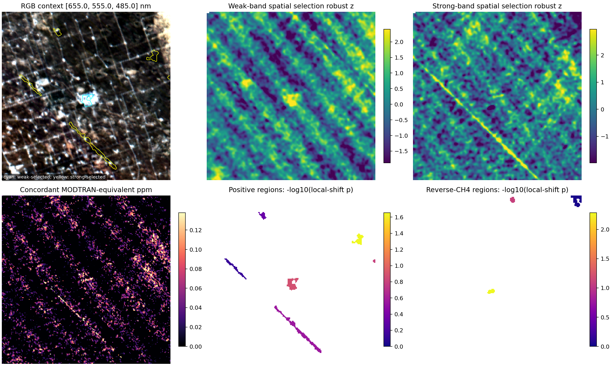
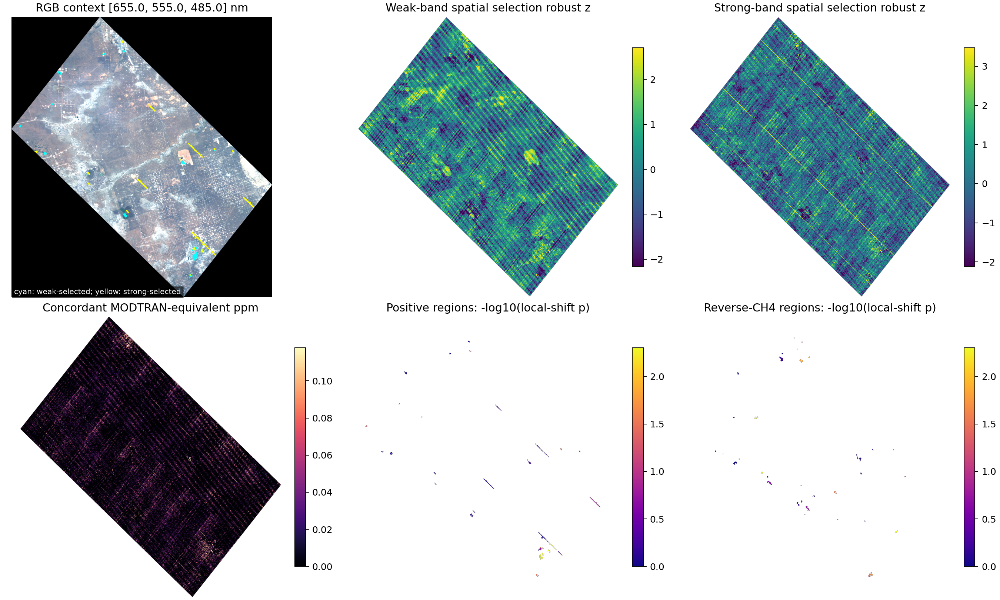
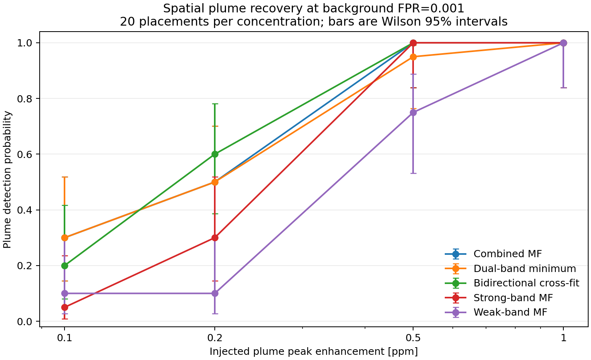
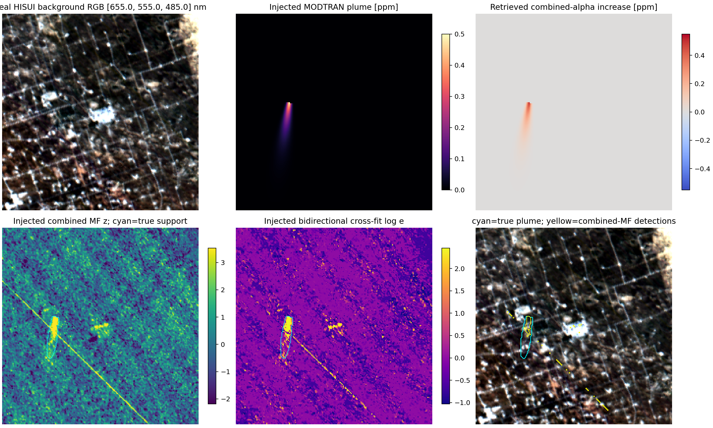

# HISUI 二吸収帯・空間プルーム画像研究

実施日: 2026-07-24

> 2026-08-02追記: 本文は200×200 ROIと初期全景解析の履歴的pilotである。後続の
> QA-strict複数シーン、単帯域screen、PDF記載DWTの感度再解析は
> [usableシーン単帯域候補報告](single_band_usable_candidates_2026-08-02.md)を参照する。

## 研究方針

画素ごとの「メタンらしさ」だけを最終成果にせず、次の三つを画像として示す研究へ
進める。

1. 一方の CH4 吸収帯だけで空間候補を作り、もう一方の未使用帯で候補領域を検証する。
2. MODTRAN の列名 `0, 0.1, ..., 5` を ppm と解釈し、検出強度を
   MODTRAN-equivalent ppm enhancement として画像化する。
3. 実 HISUI 背景へ既知形状・既知 ppm のプルームを注入し、検出確率、形状回収、
   ppm 回収を定量評価する。

この構成では、実シーンについては候補画像と負の対照を提示でき、検出器については
真値のあるプルーム画像で性能を評価できる。現時点で実在排出を断定せずとも、画像解析
手法として再現可能な研究結果になる。

## ppm の意味

`E:\refit\CH4a.csv` のヘッダは
`wavelength,0,0.1,0.2,...,5` である。本解析ではこれを ppm の濃度増分軸

$$
c\in\lbrace 0,0.1,\ldots,5\rbrace\ \mathrm{ppm}
$$

として扱った。得られる $\hat\alpha$ は、MODTRAN の $c=0$ スペクトルに対する
スペクトル変化を何 ppm 分含むか、という **MODTRAN-equivalent ppm enhancement**
である。HISUI 画素の大気中 CH4 絶対濃度そのものではない。絶対濃度化には、基準大気、
気柱長、観測幾何、地表反射率を揃えた放射伝達計算が別に必要である。

MODTRAN 放射輝度に100を掛ける単位換算は、今回使う対数勾配と対数比では相殺される。

$$
\log(100L(c))-\log(100L(0))
=\log L(c)-\log L(0).
$$

したがって100倍係数を適用しなくても、ppm テンプレート、注入差分、matched filter の
ppm 振幅は変わらない。100倍が必要なのは絶対放射輝度を直接比較するときだけである。

## 1. MODTRAN から HISUI テンプレートを作る

### SRF 畳み込み

MODTRAN の高分解能放射輝度を $L(\lambda_k,c)$、HISUI バンド中心を
$\lambda_j$ とする。FWHM 12.5 nm の Gaussian SRF を仮定し、

$$
\sigma_j=\frac{\mathrm{FWHM}_j}{2\sqrt{2\log2}},\qquad
w_{jk}=\exp\left[-\frac{(\lambda_k-\lambda_j)^2}{2\sigma_j^2}\right]
$$

$$
\widetilde L_j(c)=
\frac{\sum_k w_{jk}L(\lambda_k,c)}{\sum_k w_{jk}}
$$

で HISUI 分解能へ落とす。

### 1 ppm 当たりの log-radiance 変化

低濃度域 $c=0$–0.5 ppm でバンドごとに

$$
\log\widetilde L_j(c)=a_j+b_jc+\epsilon_{jc}
$$

を最小二乗で当てはめる。メタン増加では吸収帯の放射輝度が低下するため、検出に使う
1 ppm 当たりの target vector は

$$
t_j=b_j=-u_j,\qquad u_j=-b_j>0
$$

である。

### continuum 除去

弱吸収帯 1580–1750 nm、強吸収帯 2200–2390 nm のそれぞれで、定数と波長の
一次項を nuisance とする。各帯の design matrix を $X_g=[\mathbf 1,\lambda]$ とし、
その直交補空間の正規直交基底を $Q_g$ とする。実装は

$$
y_g=Q_g^\mathsf T\log L_g,\qquad
t_g=Q_g^\mathsf T t_g^{(raw)}
$$

を特徴量として使う。これにより、全体の明るさや滑らかな地表傾斜よりも、狭い CH4
吸収形状を照合する。

## 2. MF と波長 cross-fit

背景平均を $\mu$、$\Sigma_\rho=(1-\rho)S+\rho\,\mathrm{diag}(S)$ として
shrinkage 共分散を

$$
\widehat\Sigma=\Sigma_\rho
+\lambda\frac{\mathrm{tr}(\Sigma_\rho)}{p}I
$$

とする。残差 $r=y-\mu$ に対する通常 matched filter は

$$
\hat\alpha=
\frac{t^\mathsf T\widehat\Sigma^{-1}r}
{t^\mathsf T\widehat\Sigma^{-1}t},\qquad
z=\frac{t^\mathsf T\widehat\Sigma^{-1}r}
{\sqrt{t^\mathsf T\widehat\Sigma^{-1}t}}.
$$

$\hat\alpha$ の単位は上で定義した ppm enhancement、$z$ は背景分散で標準化した
スコアである。弱帯、強帯、両帯結合について別々に計算する。

cross-fit では、吸収帯 $A$ だけで非負振幅を選ぶ。

$$
\hat\alpha_A=\mathrm{clip}\left(
\frac{t_A^\mathsf T\Sigma_{AA}^{-1}r_A}
{t_A^\mathsf T\Sigma_{AA}^{-1}t_A},0,5\right).
$$

検証帯 $B$ では $A$ から予測できる背景変動を引き、条件付き innovation を作る。

$$
R=\Sigma_{BA}\Sigma_{AA}^{-1},\quad
v_B=r_B-Rr_A,\quad
t_{B|A}=t_B-Rt_A,
$$

$$
\Omega_{B|A}=\Sigma_{BB}-
\Sigma_{BA}\Sigma_{AA}^{-1}\Sigma_{AB}.
$$

選択した $\hat\alpha_A$ を固定して、検証帯の Gaussian likelihood ratio を

$$
\log e_{A\to B}=
\hat\alpha_A t_{B|A}^\mathsf T\Omega_{B|A}^{-1}v_B
-\frac{1}{2}\hat\alpha_A^2
t_{B|A}^\mathsf T\Omega_{B|A}^{-1}t_{B|A}
$$

とする。両方向を

$$
e_{bi}=\frac{e_{weak\to strong}+e_{strong\to weak}}{2}
$$

で平均したものが bidirectional cross-fit である。背景モデルは5分割の空間 block
cross-fitting で、対象画素を学習に再使用しない。

## 3. 観測画像の領域選択と held-out 検証

一方の帯のスコア画像を Gaussian $\sigma=1.2$ pixel で、欠損を考慮して平滑化する。

$$
\widetilde z=\frac{G_\sigma*(Mz)}{G_\sigma*M},
$$

ここで $M$ は有効画素マスクである。250×250 tile（ROI は全体）ごとに

$$
z_{rob}=\frac{\widetilde z-\mathrm{median}(\widetilde z)}
{1.4826\,\mathrm{MAD}(\widetilde z)}
$$

とする。$z_{rob}\ge3.5$ を core、$z_{rob}\ge2.0$ を extent として8近傍で
領域成長し、5–500画素の成分だけを残す。選択帯だけで決めた領域 $R$ を、もう一方の
帯の $z$ で

$$
T_R=\frac{\sum_{i\in R}w_i z_i^{(validation)}}{\sum_{i\in R}w_i},
\qquad w_i=\max(z_{rob,i}-2,0.05)
$$

と評価する。領域マスクを周囲へランダムに平行移動した $B$ 個のスコア
$T_R^{(b)}$ と比較し、

$$
p_R=\frac{1+\sum_{b=1}^{B}\mathbf 1[T_R^{(b)}\ge T_R]}{B+1}
$$

を求める。最後に正方向候補同士、逆符号候補同士でそれぞれ Benjamini–Hochberg
補正を行う。これは局所的な平行移動交換可能性を仮定する経験的診断であり、地表が
強く不均一な全景では厳密な p 値保証ではない。また、二つの波長窓に同じ地表構造が
現れるため、「別吸収帯を使った」ことだけでは統計的独立性は保証されない。局所シフトと
逆符号 CH4 は、この残る相関と空間 artifact を診断するために併用する。

二帯の ppm 整合度は

$$
D_R=\frac{|\bar\alpha_{weak}-\bar\alpha_{strong}|}
{|\bar\alpha_{weak}|+|\bar\alpha_{strong}|}
$$

で併記する。0に近いほど二帯の推定濃度が一致する。

## 4. 空間プルームの厳密 MODTRAN 注入

風下座標を $s$、風横座標を $n$ とし、画像上のプルームを

$$
w(s)=w_0+\kappa\max(s,0),
$$

$$
c(s,n)=c_{peak}\exp\left(-\frac{\max(s,0)}{L}\right)
\exp\left[-\frac12\left(\frac{n}{w(s)}\right)^2\right]
\mathbf 1(s\ge0)
$$

とした。向き、発生点、$L=15$–32 pixel、$w_0=1.5$–3.5 pixel、
$\kappa=0.06$–0.14 をランダム化する。

各画素の既知 $c_i$ について、固定 unit template を線形加算するのではなく、
MODTRAN LUT を ppm 方向に補間し、

$$
\log L_{ij}^{(inj)}=\log L_{ij}^{(obs)}+
\log\widetilde L_j(c_i)-\log\widetilde L_j(0)
$$

を注入した。背景平均・共分散は元画像だけで推定し、注入後に再学習していない。

元画像スコアの99.9 percentile、すなわち経験的背景 FPR 0.001 を各手法の閾値に
固定する。真の plume support は $c_i\ge0.1c_{peak}$ とし、閾値超過画素の8近傍
連結成分が support と3画素以上重なれば「プルーム検出」とした。

ppm 画像の回収は、support 内の真値 $c$ と回収差分
$\Delta\hat\alpha$ に対して

$$
\hat\beta=\frac{c^\mathsf T\Delta\hat\alpha}{c^\mathsf Tc},\qquad
\mathrm{RMSE}=\sqrt{\frac1N\sum_i(\Delta\hat\alpha_i-c_i)^2}
$$

および Pearson 相関で評価した。

## 結果

### 実観測 ROI



200×200 ROI では正方向6領域、逆方向3領域を4999回の局所シフトで検証した。
正方向は BH FDR 10% を通過せず、逆方向は1領域が通過した。

事前候補 R2 は弱帯選択で `y=98–112, x=95–108` の120画素として画像化された。
しかし局所シフト $p=0.132$、BH $q=0.3196$ で、弱帯0.433 ppmに対して
強帯0.0279 ppm、$D=0.879$ だった。画素ランキングでは最大 log-e 11.52、
40,000画素中3位だったが、空間・二帯整合性を課すとメタン確証にならない。
RGB の明るい地表構造に重なるため、現状は surface/instrument confuser の説明が
より妥当である。

ROI 内で最小の正方向 p 値は `y=45–58, x=172–185` の88画素で、
強帯0.117 ppm、弱帯0.195 ppm、$p=0.0222$ だった。ただし多重補正後
$q=0.1332$ で、FDR 10%には達しない。

### 全景の探索結果



有効1,562,452画素の全景では、各選択方向・各符号の selector-only 上位20領域を
199回シフトで探索した。正方向40仮説中12、逆方向40仮説中9が BH FDR 10% を
通過した。正方向だけでなく逆方向にもほぼ同程度の発見があり、スコア画像には
走査方向の周期縞と長い直線が明瞭である。この結果を「12メタン領域」と解釈しては
いけない。

数値的に最も二帯整合性が高い有意な正方向候補の一つは
`y=1526–1576, x=1292–1342`、259画素で、強帯0.216 ppm、弱帯0.183 ppm、
$D=0.0824$、$p=0.005$、$q=0.0286$ だった。ただし p 値の分解能は
$1/(199+1)=0.005$ にすぎず、同じ全景で逆方向9領域が通るため、候補順位以上の
意味は持たせない。次の独立シーン照合とストライプ補正の対象として保存する。

### 空間注入による画像検出能力



各ピーク濃度につきランダムな20配置、計80プルームを注入した。下表は背景 FPR
0.001でのプルーム単位検出確率である。括弧内は検出数/20。

|ピーク増分|combined MF|dual-min|cross-fit|strong MF|weak MF|
|---:|---:|---:|---:|---:|---:|
|0.1 ppm|0.30 (6)|0.30 (6)|0.20 (4)|0.05 (1)|0.10 (2)|
|0.2 ppm|0.50 (10)|0.50 (10)|0.60 (12)|0.30 (6)|0.10 (2)|
|0.5 ppm|1.00 (20)|0.95 (19)|1.00 (20)|1.00 (20)|0.75 (15)|
|1.0 ppm|1.00 (20)|1.00 (20)|1.00 (20)|1.00 (20)|1.00 (20)|

0.2 ppm では cross-fit が12/20、combined MF が10/20だったが、20試行の
Wilson 95%区間はそれぞれ0.387–0.781、0.299–0.701で大きく重なる。
したがって現段階で優越性は断定せず、「中程度濃度で cross-fit の利点をさらに
多数試行で検証する価値がある」と解釈する。0.5 ppm以上ではほぼ飽和し、0.1 ppm
ではどの手法も低感度である。



0.5 ppm の代表例では、実 HISUI 背景上へ注入した細長いプルームが combined MF と
cross-fit の両画像で回収された。一方、元背景に存在する斜め直線も高スコアのままで、
実シーンの線状 artifact 対策が不可欠なことも同時に見える。

combined-alpha の ppm 回収は次の通りだった。

|ピーク増分|平均傾き $\hat\beta$|平均相関|平均RMSE [ppm]|
|---:|---:|---:|---:|
|0.1|1.1025|0.999999|0.00329|
|0.2|1.0950|0.999925|0.00613|
|0.5|1.0588|0.999597|0.01049|
|1.0|1.0007|0.998730|0.01661|

形状相関は非常に高く、0.5–1.0 ppm では振幅傾きも1に近い。ただしこの精度は、
注入側と回収側が同じ MODTRAN LUT・SRF・観測幾何を共有する semi-synthetic
実験内の値である。別の大気・地表条件に対する外的妥当性を意味しない。

## 考察と次の研究

今回の主要な知見は、「検出器には画像プルームを回収する能力があるが、観測全景では
その能力より先に空間系統誤差を抑える必要がある」ということである。

1. **観測候補の主張を保留する。** R2 は弱帯のみが過大で、全景では正逆双方に
   有意領域が出た。現在のデータだけで実在メタン排出とは結論しない。
2. **画像研究の主評価を plume-level にする。** pixel TPR だけでなく、既知形状を
   何例回収できたか、ppm 画像の傾き・相関・RMSE、位置ずれ、形状 IoU を評価する。
3. **走査縞を学習データだけで補正する。** detector/column ごとの robust low-rank
   成分を候補領域を除外して推定し、補正規則を固定してから held-out シーンへ適用する。
   正方向だけでなく逆方向の発見数が名目水準へ下がることを合格条件にする。
4. **注入を難しくする。** H2O、aerosol、surface albedo、solar/view geometry を
   振った別 MODTRAN 条件で注入し、回収には一つの nominal template だけを使う。
   現在の同一 LUT 注入による楽観性を測れる。
5. **独立シーンで最終検証する。** 背景共分散、閾値、候補形状条件をこのシーンで
   固定し、別 HISUI シーンには再調整せず適用する。風向・設備位置が得られれば、
   風下形状と発生源への遡及も画像評価へ加える。

論文・発表の中心図は、(a)観測全景の二帯候補・逆符号対照、(b)既知 ppm プルームの
注入と回収、(c)濃度別 plume detection probability、(d)ppm 真値対回収値、とする。
この構成なら、実在排出の断定とは切り離して、HISUI における二吸収帯の画像検出限界と
系統誤差を同じ枠組みで示せる。

## 再現コマンド

```powershell
python scripts/spatial_region_crossvalidation.py `
  --scene-csv "D:\research\code\all_roi_spectra200x200.csv" `
  --analysis-dir outputs/crossfit_final_roi200 `
  --shift-count 4999

python scripts/spatial_region_crossvalidation.py `
  --scene-csv "E:\refit\all_map_spectra.csv" `
  --analysis-dir outputs/crossfit_final_full_scene `
  --shift-count 199 `
  --shift-radius 25 `
  --minimum-shift 5 `
  --maximum-regions-per-direction 20 `
  --chunksize 100000

python scripts/spatial_plume_injection_benchmark.py `
  --scene-csv "D:\research\code\all_roi_spectra200x200.csv" `
  --modtran-csv "E:\refit\CH4a.csv" `
  --output-dir outputs/spatial_plume_injection_final `
  --peaks-ppm 0.1,0.2,0.5,1 `
  --trials-per-peak 20 `
  --representative-peak-ppm 0.5
```

生データと `outputs/` は Git 管理外とし、コード、テスト、数値報告、代表図を保存する。
